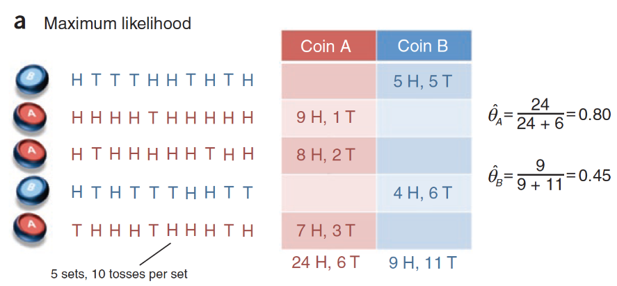
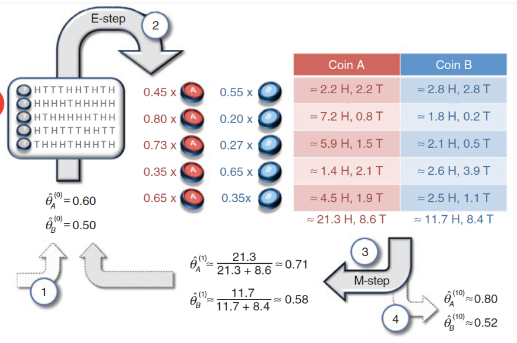
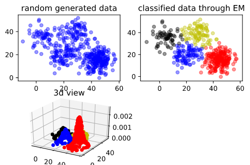

# 1、前言
$EM$算法即期望最大化算法，是用于计算最大似然估计的迭代方法，常用在隐变量模型的参数学习中，所谓隐变量就是指<font color="#F00">数据的不完整性</font>，也就是**训练数据并不能给出关于模型结果的全部信息**，因此只能对模型中未知的状态做出概率性的推测。
- $E$步：求期望（expectation），用当前的参数来生成关于隐变量概率的期望函数
- $M$步：求极大（maximization)，寻找让期望函数最大化的一组参数，并将这组参数应用到下一轮的期望步骤中。
如此循环往复，算法就可以估计出隐变量的概率分布。

**$EM$算法虽然可以在不能直接求解方程时找到统计模型的最大似然参数，但它并不能保证收敛到全局最优。**一般来说，似然函数的最大化会涉及对所有未知参量求导，这在隐变量模型中是无法实现的。

$EM$算法的解决方法是将求解过程转化为一组互锁的方程，它们就像联动的齿轮一样，通过待求解参数和未知状态变量的不断迭代、交叉使用来求解最大似然。

# 2、EM算法引入
先看期刊《自然·生物技术》上的一个例子：
假定有两枚不同的硬币$A$和$B$，它们的重量分布（跑一次出现正面概率）$\theta_A$和$\theta_B$是未知的，其数值可通过抛掷后计算正反面各自出现的次数来估计。具体的估计方法是在每一轮中随机抽出一枚硬币抛掷10次，同样的过程执行5轮，根据这50次投币的结果来计算$\theta_A$和$\theta_B$的最大似然估计。

在上图的单次试验中，硬币$A$被抽到3次，30次投掷中出现了24次正面；硬币$B$被抽到2次，20次投掷中出现了9次正面。用最大似然估计可以计算出$\hat{\theta}_A=24/(24+6)=0.8,\hat{\theta}_B=9/(9+11)=0.45$

这个问题很简单，但是如果我们只能知道每一轮中出现的正反面结果，却不能得知到底选取的硬币是$A$还是$B$，问题就没那么简单了。<font color='#F00'>这里的硬币选择就是不能直接观测的隐变量。</font>如果不管这个隐变量，就无法估计未知参数；要确定这一组隐变量，又得基于未知的硬币重量分布，问题进入了死胡同。

既然数据中信息不完整，那就人为地补充完整。在这个问题中，隐藏的硬币选择和待估计的重量分布，两者确定一个就可以计算另一个。

由于观测结果给出了关于重量分布的信息，那就不放人为设定一组初始化的参数$\hat{\theta}^{(t)}=(\hat{\theta}_A^{(t)},\hat{\theta}_B^{(t)})$，用这组猜测的重量分布去倒推到底每一轮使用的是哪个硬币。
计算出来的硬币选择会被用来对原来随机产生的初始化参数进行更新。如果硬币选择的结果是正确的，就可以利用最大似然估计计算出新的参数$\hat{\theta}^{(t+1)}$。而更新后的参数有可以应用在观测结果上，对硬币选择的结果进行修正，从而形成了“批评-自我批评”的循环过程。这个过程会持续到隐变量和未知参数的取值都不再发生变化，其结果就是最终的输出。
将思路应用到下图的投掷结果中，就是$EM$算法的雏形。


将两个初始的参数随机设定为$\hat{\theta}_A^{(0)}=0.6,\hat{\theta}_B^{(0)}=0.5$，在这两个参数下出现第一轮结果，也就是5正5反的概率就可以表示为
$$P(H^5T^5|A)=0.6^5\times0.4^5,P(H^5T^5|B)=0.5^{10}$$
对上面的两个似然概率进行归一化可以得出后验概率，两者分别是0.45和0.55，也就是下图中的结果。这说明如果初始结果的随机参数是准确的，拿第一轮结果更可能由硬币$B$产生（0.55>0.45）。同理也可以计算出其他四轮的结果来自不同硬币的后验概率，结果已经在上图中显示。

在已知硬币的选择时，所有正反面的结果都有明确的归属：要么来自$A$要么来自$B$。利用后验概率可以直接对硬币的选择作出判断：1、4轮使用的是硬币$B$，2、3、5轮使用的是硬币$A$。

既然硬币的选择已经确定，这时就可以使用最大似然估计，其结果和前文中的最大似然估计结果是相同的，也就是 $\hat{\theta}_A^{(1)}=0.8,\hat{\theta}_B^{(1)}=0.45$。利用这组更新的参数又可以重新计算每一轮次抽取不同硬币的后验概率。

虽然这种方法能够实现隐变量和参数的动态更新，但它还不是真正的$EM$算法，而是**硬输出的$k$均值聚类**。真正的$EM$算法并不会将后验概率最大的值赋给隐变量，而是**考虑其所有可能的取值**，在概率分布的框架下进行分析。

在前面的例子中，由于第一轮投掷硬币$A$的可能性是0.45，那么硬币$A$对正反面出现次数的贡献就是45%，在5次正面的结果中，来源于硬币$A$的就是 5×0.45=2.25 次，来源于硬币$B$的则是2.75次。同理可以计算出其他轮次中$A$和$B$各自的贡献，贡献的比例都和计算出的后验概率相对应。

计算出$A$和$B$在不同轮次中的贡献，就可以对未知参数做出更加精确的估计。在 50 次投掷中，硬币$A$贡献了21.3次正面和8.6次反面，其参数估计值$\hat{\theta}_A^{(1)}=0.71$；硬币$B$贡献了11.7次正面和8.4次反面，其参数估计值$\hat{\theta}_B^{(1)}=0.58$。利用这组参数继续迭代更新，就可以计算出最终的估计值。

******

概率模型有时候既含有观测变量，又含有隐变量或潜在变量，如果概率模型的变量都是**观测变量**，那么给定数据，可以直接用**极大似然估计法**，或**贝叶斯估计方法**估计模型参数，但是<font color="#F00">当模型含有**隐变量**时，就不能简单的使用这些方法，EM算法就是**含有隐变量的概率模型**参数的*极大似然估计法*，或*极大后验概率估计法*，</font>我们讨论极大似然估计，极大后验概率估计与其类似。

# 3、EM算法 
输入：观测变量数据$Y$，隐变量数据$Z$，联合分布$P(Y,Z|\theta)$，条件分布$P(Z|Y,\theta)$；
输出：模型参数$\theta$
- (1)选择参数的初值$\theta^0$，开始迭代
- (2) $E$步：记$\theta^i$为第i次迭代参数$\theta$的估计值，在第i+1次迭代的$E$步，计算
$$
\begin{aligned}
Q(\theta,\theta^i)&=E_{Z}[logP(Y,Z|\theta)|Y,\theta^i]\\
&=\sum_{Z}logP(Y,Z|\theta)P(Z|Y,\theta^i)
\end{aligned}
$$
这里，$P(Z|Y,\theta^i)$是在给定观测数据Y和当前的参数估计$\theta^i$下隐变量数据$Z$的条件概率分布；

- (3) $M$步：求使$Q(\theta,\theta^i)$极大化的$\theta$，确定第$i+1$次迭代的参数的估计值$\theta^{i+1}$，
$$
\theta^{i+1}=arg \max \limits_{\theta}Q(\theta,\theta^{i})
$$
$Q(\theta,\theta^{i})$是$EM$算法的核心，称为$Q$函数($Q$ function)，这个是需要自己构造的。
- (4) 重复第(2)步和第(3)步，直到收敛，收敛条件：
$$
|| \theta^{i+1}-\theta^{i} || < \varepsilon_1
$$
或者：
$$
||Q(\theta^{i+1},\theta^{i})-Q(\theta^{i},\theta^{i})|| <\varepsilon_2
$$
收敛迭代就结束了。我们来拆解一下这个$M$步骤，

# 4、推导逼近
主要讲解$Jensen$不等式，这个公式在推导和收敛都用到，主要是如下的结论：
- $f(x)$是凸函数
$$
f(E(X)) \le E(f(x))
$$
- $f(x)$是凹函数
$$
f(E(X)) \ge E(f(x))
$$

推导出$EM$算法可以近似实现对观测数据的极大似然估计的办法是找到E步骤的下界，让下界最大，通过逼近的方式实现对观测数据的最大似然估计。统计学习基础中采用的是相减方式，我们来看下具体的步骤。
- 增加隐藏变量
$$
L(\theta)=\sum_{Z}logP(Y|Z,\theta)P(Z,\theta)
$$
则$L(\theta)-L(\theta^{i})$为：
$$
\begin{aligned}
L(\theta)-L(\theta^{i})=log(\sum_{Z} P(Y|Z,\theta^i)\frac{P(Y|Z,\theta)P(Z,\theta)}{P(Y|Z,\theta^i)})-L(\theta^{i})\\
\ge \sum_{Z} P(Y|Z,\theta^i)log(\frac{P(Y|Z,\theta)P(Z,\theta)}{P(Y|Z,\theta^i)})-L(\theta^{i})
\end{aligned}
$$
$\ge$这一个步骤就是采用了凹函数的$Jensen$不等式做转换。因为$Z$是隐藏变量，所以有$\sum_{Z} P(Y|Z,\theta^i)==1，P(Y|Z,\theta^i)>0$，于是继续变：

$$
\begin{aligned}
L(\theta)-L(\theta^{i})&=log(\sum_{Z} P(Y|Z,\theta^i)\frac{P(Y|Z,\theta)P(Z,\theta)}{P(Y|Z,\theta^i)})-L(\theta^{i})\\
&\ge \sum_{Z} P(Z|Y,\theta^i)log(\frac{P(Y|Z,\theta)P(Z,\theta)}{P(Z|Y,\theta^i)})-L(\theta^{i})\\
&=\sum_{Z} P(Z|Y,\theta^i)log(\frac{P(Y|Z,\theta)P(Z,\theta)}{P(Z|Y,\theta^i)})-\sum_{Z} P(Z|Y,\theta^i)L(\theta^{i})\\
&= \sum_{Z} P(Z|Y,\theta^i)log(\frac{P(Y|Z,\theta)P(Z,\theta)}{P(Z|Y,\theta^i) (P(Y|\theta^{i})}) \\
& \ge0
\end{aligned}
$$
也就是：$L(\theta)\ge L(\theta^{i})+ \sum_{Z} P(Z|Y,\theta^i)log(\frac{P(Y|Z,\theta)P(Z,\theta)}{P(Y|Z,\theta^i) L(\theta^{i})})$，有下界，最大化下界，来得到近似值。这里有一个细节：$P(Y|Z,\theta^i)$ 变为$P(Z|Y,\theta^i)$？如果要满足$Jensen$不等式的等号，则有：
$$
\frac{P(Y|Z,\theta)P(Z,\theta)}{P(Y|Z,\theta^i)} = c
$$
$c$为一个常数，而$\sum_{Z}P(Y|Z,\theta^i)=1$则：
$$
\begin{aligned}
\sum_{Z}P(Y|Z,\theta)P(Z,\theta)= c\sum_{Z}P(Y|Z,\theta^i)&=c\\
&=\frac{P(Y|Z,\theta)P(Z,\theta)}{P(Y|Z,\theta^i)}\\
P(Y|Z,\theta)=\frac{P(Y|Z,\theta)P(Z,\theta)}{\sum_{Z}P(Y|Z,\theta)P(Z,\theta)}=\frac{P(Y,Z,\theta)}{P(Y,\theta)}=P(Z|Y,\theta)
\end{aligned}
$$

大家是不是很奇怪$P(Y|Z,\theta)P(Z,\theta)$加上$\sum$之后等于什么，其实有的博客这里使用$P(Z,\theta) = P(Y^i,Z^i,\theta^i)$来替代$P(Y|Z,\theta)$参与计算，这样$\sum_{Z}P(Y^i,Z^i,\theta^i)$，这样就方便理解来了。

于是最大化如下：

$$
\begin{aligned}
\theta^{i+1}&=arg \max_{\theta}\sum_{Z} P(Z|Y,\theta^i)log(\frac{P(Y|Z,\theta)P(Z,\theta)}{P(Z|Y,\theta^i)})\\
&=arg \max_{\theta}\sum_{Z} P(Z|Y,\theta^i)log(P(Y|Z,\theta)P(Z,\theta))\\
& =arg \max_{\theta}\sum_{Z} P(Z|Y,\theta^i)log(P(Y,Z|\theta))\\ 
&=arg \max_{\theta}Q(\theta,\theta^i)
\end{aligned} 
$$
其中$log$分母提出来是关于$Z$的$\sum_{Z} P(Z|Y,\theta^i)logP(Z|Y,\theta^i)$，可以去掉。当然也有博客写的形式是：
$$
arg \max_{\theta}\sum_{i=1}^{M}\sum_{Z^{i}} P(Z^{i}|Y^{i},\theta^i)log(P(Y^{i},Z^{i};\theta))\\ 
$$
形式其实一样，表示的不一样而已。

# 5、证明收敛
我们知道已知观测数据的似然函数是$P(Y,\theta)$，对数似然函数为：
$$
\begin{aligned}
L()=\sum_{i=1}^{M}logP(y^{i},\theta) &=\sum_{i=1}^{M}log(\frac{P(y^i,Z|\theta)}{P(Z|y^i,\theta)})\\
&=\sum_{i=1}^{M}logP(y^i,Z|\theta) - \sum_{i=1}^{M}logP(Z|y^i,\theta)
\end{aligned} 
$$
要证明收敛，就证明单调递增，$\sum_{i=1}^{M}logP(y^{i},\theta^{j+1})>\sum_{i=1}^{M}logP(y^{i},\theta^{j})$
由上文知道：
$$
\begin{aligned}
Q(\theta,\theta^i)&=\sum_{Z}logP(Y,Z|\theta)P(Z|Y,\theta^i)\\
&=\sum_{i=1}^{M}\sum_{Z^j}logP(y^i,Z^j|\theta)P(Z^j|y^i,\theta^i)
\end{aligned}
$$
我们构造一个函数$H$，让他等于：
$$
H(\theta,\theta^{i})=\sum_{i=1}^{M}\sum_{Z^j}log(P(Z|y^i,\theta)P(Z|y^i,\theta^i))
$$
让$Q(\theta,\theta^i)-H(\theta,\theta^{i})$：
$$
\begin{aligned}
Q(\theta,\theta^i)-H(\theta,\theta^{i})&=\sum_{i=1}^{M}\sum_{Z^j}logP(y^i,Z^j|\theta)P(Z^j|y^i,\theta^i) - \sum_{i=1}^{M}\sum_{Z^j}log(P(Z^j|y^i,\theta)P(Z^j|y^i,\theta^i)) \\
&=\sum_{i=1}^{M}\sum_{Z^j}log\bigg(P(y^i,Z^j|\theta)-P(Z^j|y^i,\theta)\bigg) \\
&=\sum_{i=1}^{M}logP(y^{i},\theta) 
\end{aligned}
$$
所以：
$$
\sum_{i=1}^{M}logP(y^{i},\theta^{j+1})-\sum_{i=1}^{M}logP(y^{i},\theta^{j}) \\
= Q(\theta^{i+1},\theta^i)-H(\theta^{i+1},\theta^{i}) - (Q(\theta^{i},\theta^{i})-H(\theta^{i},\theta^{i}))\\
= Q(\theta^{i+1},\theta^i)- Q(\theta^{i},\theta^{i}) -( H(\theta^{i+1},\theta^{i}) - H(\theta^{i},\theta^{i}))
$$
该公式左边已经被证明是大于0，证明右边：$H(\theta^{i+1},\theta^{i}) - H(\theta^{i},\theta^{i})<0$：
$$
\begin{aligned}
H(\theta^{i+1},\theta^{i}) - H(\theta^{i},\theta^{i}) &=\sum_{Z^j}\bigg(log(\frac{P(Z^j|Y,\theta^{i+1})}{P(Z^j|Y,\theta^i)}) \bigg)P(Z^j|Y,\theta^i) \\
&=log\bigg(\sum_{Z^j}\frac{P(Z^j|Y,\theta^{i+1})}{P(Z^j|Y,\theta^i)}P(Z^j|Y,\theta^i) \bigg)\\
&=logP(Z|Y,\theta^{i+1})=log1=0
\end{aligned}
$$
其中不等式是由于$Jensen$不等式，由此证明了$\sum_{i=1}^{M}logP(y^{i},\theta^{j+1})>\sum_{i=1}^{M}logP(y^{i},\theta^{j})$，证明了$EM$算法的收敛性。但不能保证是全局最优，只能保证局部最优。

# 6、高斯混合分布
EM算法的一个重要应用场景就是高斯混合模型的参数估计。高斯混合模型就是由多个高斯模型组合在一起的混合模型（可以理解为多个高斯分布函数的线性组合，理论上高斯混合模型是可以拟合任意类型的分布），例如对于下图中的数据集如果用一个高斯模型来描述的话显然是不合理的：


两个高斯模型可以拟合数据集，如图所示：


如果有多个高斯模型，公式表示为：
$$
P(y|\theta)=\sum_{k=1}^{K}a_k\phi(y|\theta_{k}) \\
\phi(y|\theta_{k})=\frac{1}{\sqrt{2\pi}\delta_{k}}exp(-\frac{(y-\mu_{k})^2}{2 \delta_{k}^{2}}) \\
a_k>0,\sum a_k =1
$$
$\phi(y|\theta_{k})$表示为第k个高斯分布密度模型，定义如上，其中$a_k$表示被选中的概率。在本次模型$P(y|\theta)$中，观测数据是已知的，而观测数据具体来自哪个模型是未知的，有点像之前提过的三硬币模型，我们来对比一下，$A$硬币就像是概率$a_k$，用来表明具体的模型，而$B、C$硬币就是具体的模型，只不过这里有很多个模型，不仅仅是$B、C$这两个模型。我们用$\gamma_{jk}$来表示，则：
$$
\gamma_{jk} =
\begin{cases}
1& \text{第j个观测数据来源于第k个模型}\\
0& \text{否则}
\end{cases}
$$
所以一个观测数据$y_j$的隐藏数据$(\gamma_{j1},\gamma_{j2},...,\gamma_{jk})$，那么完全似然函数就是：

$$
P(y,\gamma|\theta)= \prod_{k=1}^{K}\prod_{j=1}^{N}[a_{k}\phi(y|\theta_{k})]^{\gamma_{jk}}
$$

取对数之后等于：

$$
\begin{aligned}
log(P(y,\gamma|\theta))&=log( \prod_{k=1}^{K}\prod_{j=1}^{N}[a_{k}\phi(y|\theta_{k})]^{\gamma_{jk}})\\
&=\sum_{K}^{k=1}\bigg(\sum_{j=1}^{N}(\gamma_{jk}) log(a_k)+\sum_{j=1}^{N}( \gamma_{jk})\bigg[log(\frac{1}{\sqrt{2\pi}})-log(\delta_{k})-\frac{(y_i-\mu_{k})^2}{2 \delta_{k}^{2}}\bigg]\bigg)
\end{aligned}
$$

- $E$ 步 ：
$$
\begin{aligned}
Q(\theta.\theta^i) &= E[log(P(y,\gamma|\theta))]\\
&=\sum_{K}^{k=1}\bigg(\sum_{j=1}^{N}(E\gamma_{jk}) log(a_k)+\sum_{j=1}^{N}(E\gamma_{jk})\bigg[log(\frac{1}{\sqrt{2\pi}})-log(\delta_{k})-\frac{(y_i-\mu_{k})^2}{2 \delta_{k}^{2}}\bigg]\bigg)
\end{aligned}
$$
其中我们定义$\hat{\gamma_{jk}}$：
$$
\hat{\gamma_{jk}} = E(\gamma_{jk}|y,\theta)=\frac{a_k\phi(y_i|\theta_{k})}{\sum_{k=1}^{K}a_k\phi(y_i|\theta_{k}) }\\
j=1,2,..,N；k=1,2,...,K\\
n_k=\sum_{j=i}^{N}E\gamma_{jk}
$$
于是化简得到：
$$
\begin{aligned}
Q(\theta.\theta^i) &= \sum_{K}^{k=1}\bigg(n_k log(a_k)+\sum_{j=1}^{N}(E\gamma_{jk})\bigg[log(\frac{1}{\sqrt{2\pi}})-log(\delta_{k})-\frac{(y_i-\mu_{k})^2}{2 \delta_{k}^{2}}\bigg]\bigg)
\end{aligned}
$$

$E$步在代码设计上只有$\hat{\gamma_{jk}}$有用，用于M步的计算。


- $M$步，
$$
\theta^{i+1}=arg \max_{\theta}Q(\theta,\theta^i)
$$
对$Q(\theta,\theta^i)$求导，得到每个未知量的偏导，使其偏导等于0，求解得到：
$$
\hat{\mu_k}=\frac{\sum_{j=1}^{N}\hat{\gamma_{jk}}y_i}{\sum_{j=1}^{N}\hat{\gamma_{jk}}}
\\
\\
\hat{\delta_k}=\frac{\sum_{j=1}^{N}\hat{\gamma_{jk}}(y_i-\mu_k)^2}{\sum_{j=1}^{N}\hat{\gamma_{jk}}}

\hat{a_k}=\frac{\sum_{j=1}^{N}\hat{\gamma_{jk}} }{N}
$$
给一个初始值，来回迭代就可以求得值内容。这一块主要用到了$Q(\theta.\theta^i)$的导
数，并且用到了E步的$\hat{\gamma_{jk}}$。


# 7、代码
```python
import numpy as np
import random
import math
import time
```

```python
'''
数据集：伪造数据集（两个高斯分布混合）
数据集长度：1000
------------------------------
运行结果：
----------------------------
the Parameters set is:
alpha0:0.3, mu0:0.7, sigmod0:-2.0, alpha1:0.5, mu1:0.5, sigmod1:1.0
----------------------------
the Parameters predict is:
alpha0:0.4, mu0:0.6, sigmod0:-1.7, alpha1:0.7, mu1:0.7, sigmod1:0.9
----------------------------
'''

def loadData(mu0, sigma0, mu1, sigma1, alpha0, alpha1):
    '''
    初始化数据集
    这里通过服从高斯分布的随机函数来伪造数据集
    :param mu0: 高斯0的均值
    :param sigma0: 高斯0的方差
    :param mu1: 高斯1的均值
    :param sigma1: 高斯1的方差
    :param alpha0: 高斯0的系数
    :param alpha1: 高斯1的系数
    :return: 混合了两个高斯分布的数据
    '''
    # 定义数据集长度为1000
    length = 1000

    # 初始化第一个高斯分布，生成数据，数据长度为length * alpha系数，以此来
    # 满足alpha的作用
    data0 = np.random.normal(mu0, sigma0, int(length * alpha0))
    # 第二个高斯分布的数据
    data1 = np.random.normal(mu1, sigma1, int(length * alpha1))

    # 初始化总数据集
    # 两个高斯分布的数据混合后会放在该数据集中返回
    dataSet = []
    # 将第一个数据集的内容添加进去
    dataSet.extend(data0)
    # 添加第二个数据集的数据
    dataSet.extend(data1)
    # 对总的数据集进行打乱（其实不打乱也没事，只不过打乱一下直观上让人感觉已经混合了
    # 读者可以将下面这句话屏蔽以后看看效果是否有差别）
    random.shuffle(dataSet)

    #返回伪造好的数据集
    return dataSet
```

```python
# 高斯分布公式
def calcGauss(dataSetArr, mu, sigmod):
    '''
    根据高斯密度函数计算值
    依据：“9.3.1 高斯混合模型” 式9.25
    注：在公式中y是一个实数，但是在EM算法中(见算法9.2的E步)，需要对每个j
    都求一次yjk，在本实例中有1000个可观测数据，因此需要计算1000次。考虑到
    在E步时进行1000次高斯计算，程序上比较不简洁，因此这里的y是向量，在numpy
    的exp中如果exp内部值为向量，则对向量中每个值进行exp，输出仍是向量的形式。
    所以使用向量的形式1次计算即可将所有计算结果得出，程序上较为简洁
    
    :param dataSetArr: 可观测数据集
    :param mu: 均值
    :param sigmod: 方差
    :return: 整个可观测数据集的高斯分布密度（向量形式）
    '''
    # 计算过程就是依据式9.25写的，没有别的花样
    result = (1 / (math.sqrt(2*math.pi)*sigmod**2)) * np.exp(-1 * (dataSetArr-mu) * (dataSetArr-mu) / (2*sigmod**2))
    # 返回结果
    return result


def E_step(dataSetArr, alpha0, mu0, sigmod0, alpha1, mu1, sigmod1):
    '''
    EM算法中的E步
    依据当前模型参数，计算分模型k对观数据y的响应度
    :param dataSetArr: 可观测数据y
    :param alpha0: 高斯模型0的系数
    :param mu0: 高斯模型0的均值
    :param sigmod0: 高斯模型0的方差
    :param alpha1: 高斯模型1的系数
    :param mu1: 高斯模型1的均值
    :param sigmod1: 高斯模型1的方差
    :return: 两个模型各自的响应度
    '''
    # 计算y0的响应度
    # 先计算模型0的响应度的分子
    gamma0 = alpha0 * calcGauss(dataSetArr, mu0, sigmod0)
    #print("gamma0=",gamma0.shape) # 1000, 维向量
    # 模型1响应度的分子
    gamma1 = alpha1 * calcGauss(dataSetArr, mu1, sigmod1)

    # 两者相加为E步中的分布
    sum = gamma0 + gamma1
    # 各自相除，得到两个模型的响应度
    gamma0 = gamma0 / sum
    gamma1 = gamma1 / sum

    # 返回两个模型响应度
    return gamma0, gamma1

def M_step(muo, mu1, gamma0, gamma1, dataSetArr):
    # 依据算法9.2计算各个值
    # 这里没什么花样，对照书本公式看看这里就好了
    
    # np.dot 点积：[1,2] [2,3] = [2,6]
    mu0_new = np.dot(gamma0, dataSetArr) / np.sum(gamma0)
    mu1_new = np.dot(gamma1, dataSetArr) / np.sum(gamma1)

    # math.sqrt  平方根 
    sigmod0_new = math.sqrt(np.dot(gamma0, (dataSetArr - muo)**2) / np.sum(gamma0))
    sigmod1_new = math.sqrt(np.dot(gamma1, (dataSetArr - mu1)**2) / np.sum(gamma1))

    alpha0_new = np.sum(gamma0) / len(gamma0)
    alpha1_new = np.sum(gamma1) / len(gamma1)

    # 将更新的值返回
    return mu0_new, mu1_new, sigmod0_new, sigmod1_new, alpha0_new, alpha1_new


## 训练主函数
def EM_Train(dataSetList, iter=500):
    '''
    根据EM算法进行参数估计
    算法依据“9.3.2 高斯混合模型参数估计的EM算法” 算法9.2
    :param dataSetList:数据集（可观测数据）
    :param iter: 迭代次数
    :return: 估计的参数
    '''
    # 将可观测数据y转换为数组形式，主要是为了方便后续运算
    dataSetArr = np.array(dataSetList)

    # 步骤1：对参数取初值，开始迭代
    alpha0 = 0.5
    mu0 = 0
    sigmod0 = 1
    alpha1 = 0.5
    mu1 = 1
    sigmod1 = 1

    # 开始迭代
    step = 0
    while (step < iter):
        # 每次进入一次迭代后迭代次数加1
        step += 1
        # 步骤2：E步：依据当前模型参数，计算分模型k对观测数据y的响应度
        gamma0, gamma1 = E_step(dataSetArr, alpha0, mu0, sigmod0, alpha1, mu1, sigmod1)
        # 步骤3：M步
        mu0, mu1, sigmod0, sigmod1, alpha0, alpha1 = M_step(mu0, mu1, gamma0, gamma1, dataSetArr)

    # 迭代结束后将更新后的各参数返回
    return alpha0, mu0, sigmod0, alpha1, mu1, sigmod1
```

```python
if __name__ == '__main__':
    start = time.time()

    # 设置两个高斯模型进行混合，这里是初始化两个模型各自的参数
    # 见“9.3 EM算法在高斯混合模型学习中的应用”
    # alpha是“9.3.1 高斯混合模型” 定义9.2中的系数α
    # mu0是均值μ
    # sigmod是方差σ
    # 在设置上两个alpha的和必须为1，其他没有什么具体要求，符合高斯定义就可以
    
    alpha0 = 0.3  # 系数α
    mu0 = -2  # 均值μ
    sigmod0 = 0.5  # 方差σ

    alpha1 = 0.7  # 系数α
    mu1 = 0.5  # 均值μ
    sigmod1 = 1  # 方差σ

    # 初始化数据集
    dataSetList = loadData(mu0, sigmod0, mu1, sigmod1, alpha0, alpha1)

    #打印设置的参数
    print('---------------------------')
    print('the Parameters set is:')
    print('alpha0:%.1f, mu0:%.1f, sigmod0:%.1f, alpha1:%.1f, mu1:%.1f, sigmod1:%.1f' % (
        alpha0, alpha1, mu0, mu1, sigmod0, sigmod1
    ))

    # 开始EM算法，进行参数估计
    alpha0, mu0, sigmod0, alpha1, mu1, sigmod1 = EM_Train(dataSetList)

    # 打印参数预测结果
    print('----------------------------')
    print('the Parameters predict is:')
    print('alpha0:%.1f, mu0:%.1f, sigmod0:%.1f, alpha1:%.1f, mu1:%.1f, sigmod1:%.1f' % (
        alpha0, alpha1, mu0, mu1, sigmod0, sigmod1
    ))

    # 打印时间
    print('----------------------------')
    print('time span:', time.time() - start)
```

```
---------------------------
the Parameters set is:
alpha0:0.3, mu0:0.7, sigmod0:-2.0, alpha1:0.5, mu1:0.5, sigmod1:1.0
----------------------------
the Parameters predict is:
alpha0:0.4, mu0:0.6, sigmod0:-1.8, alpha1:0.7, mu1:0.7, sigmod1:0.9
----------------------------
time span: 0.28402137756347656
```

```python
import math
import copy
import numpy as np
import matplotlib.pyplot as plt
from mpl_toolkits.mplot3d import Axes3D
 
#生成随机数据，4个高斯模型
def generate_data(sigma,N,mu1,mu2,mu3,mu4,alpha):
    global X                  #可观测数据集
    X = np.zeros((N, 2))       # 初始化X，2行N列。2维数据，N个样本
    X=np.matrix(X)
    global mu                 #随机初始化mu1，mu2，mu3，mu4
    mu = np.random.random((4,2))
    mu=np.matrix(mu)
    global excep              #期望第i个样本属于第j个模型的概率的期望
    excep=np.zeros((N,4))
    global alpha_             #初始化混合项系数
    alpha_=[0.25,0.25,0.25,0.25]
    for i in range(N):
        if np.random.random(1) < 0.1:  # 生成0-1之间随机数
            X[i,:]  = np.random.multivariate_normal(mu1, sigma, 1)     #用第一个高斯模型生成2维数据
        elif 0.1 <= np.random.random(1) < 0.3:
            X[i,:] = np.random.multivariate_normal(mu2, sigma, 1)      #用第二个高斯模型生成2维数据
        elif 0.3 <= np.random.random(1) < 0.6:
            X[i,:] = np.random.multivariate_normal(mu3, sigma, 1)      #用第三个高斯模型生成2维数据
        else:
            X[i,:] = np.random.multivariate_normal(mu4, sigma, 1)      #用第四个高斯模型生成2维数据
 
    print("可观测数据：\n",X)       #输出可观测样本
    print("初始化的mu1，mu2，mu3，mu4：",mu)      #输出初始化的mu


# E 期望
#  \hat{\gamma_{jk}}
def e_step(sigma,k,N):
    global X
    global mu
    global excep
    global alpha_
    for i in range(N):
        denom=0
        for j in range(0,k):
            #  sigma.I 表示矩阵的逆矩阵
            # np.transpose ：矩阵转置   np.linalg.det():矩阵求行列式
            denom += alpha_[j]*  math.exp(-(X[i,:]-mu[j,:])*sigma.I*np.transpose(X[i,:]-mu[j,:]))  /np.sqrt(np.linalg.det(sigma))       #分母
        for j in range(0,k):
            numer = math.exp(-(X[i,:]-mu[j,:])*sigma.I*np.transpose(X[i,:]-mu[j,:]))/np.sqrt(np.linalg.det(sigma))        #分子
            excep[i,j]=alpha_[j]*numer/denom      #求期望
    print("隐藏变量：\n",excep)

    
def m_step(k,N):
    global excep
    global X
    global alpha_
    for j in range(0,k):
        denom=0   #分母
        numer=0   #分子
        for i in range(N):
            numer += excep[i,j]*X[i,:]
            denom += excep[i,j]
        mu[j,:] = numer/denom    #求均值
        alpha_[j]=denom/N        #求混合项系数

        #     #可视化结果
def plotShow():
    # 画生成的原始数据
    plt.subplot(221)
    plt.scatter(X[:,0].tolist(), X[:,1].tolist(),c='b',s=25,alpha=0.4,marker='o')    #T散点颜色，s散点大小，alpha透明度，marker散点形状
    plt.title('random generated data')
    #画分类好的数据
    plt.subplot(222)
    plt.title('classified data through EM')
    order=np.zeros(N)
    color=['b','r','k','y']
    for i in range(N):
        for j in range(k):
            if excep[i,j]==max(excep[i,:]):
                order[i]=j     #选出X[i,:]属于第几个高斯模型
            probility[i] += alpha_[int(order[i])]*math.exp(-(X[i,:]-mu[j,:])*sigma.I*np.transpose(X[i,:]-mu[j,:]))/(np.sqrt(np.linalg.det(sigma))*2*np.pi)    #计算混合高斯分布
        plt.scatter(X[i, 0], X[i, 1], c=color[int(order[i])], s=25, alpha=0.4, marker='o')      #绘制分类后的散点图
    #绘制三维图像
    ax = plt.subplot(223, projection='3d')
    plt.title('3d view')
    for i in range(N):
        ax.scatter(X[i, 0], X[i, 1], probility[i], c=color[int(order[i])])
    plt.show()
```

```python
if __name__ == '__main__':
    iter_num=1000  #迭代次数
    N=500         #样本数目
    k=4            #高斯模型数
    probility = np.zeros(N)    #混合高斯分布
    u1=[5,35]
    u2=[30,40]
    u3=[20,20]
    u4=[45,15]
    sigma=np.matrix([[30, 0], [0, 30]])               #协方差矩阵
    alpha=[0.1,0.2,0.3,0.4]         #混合项系数
    generate_data(sigma,N,u1,u2,u3,u4,alpha)     #生成数据
    #迭代计算
    for i in range(iter_num):
        err=0     #均值误差
        err_alpha=0    #混合项系数误差
        Old_mu = copy.deepcopy(mu)
        Old_alpha = copy.deepcopy(alpha_)
        
        e_step(sigma,k,N)     # E步
        m_step(k,N)           # M步
        
        print("迭代次数:",i+1)
        print("估计的均值:",mu)
        print("估计的混合项系数:",alpha_)
        for z in range(k):
            err += (abs(Old_mu[z,0]-mu[z,0])+abs(Old_mu[z,1]-mu[z,1]))      #计算误差
            err_alpha += abs(Old_alpha[z]-alpha_[z])
        if (err<=0.001) and (err_alpha<0.001):     #达到精度退出迭代
            print(err,err_alpha)
            break
```

```
109e-25 9.99488022e-01 1.29388453e-22]
 ...
 [1.99757796e-05 4.17687378e-28 9.99980024e-01 4.95350725e-25]
 [2.45358493e-10 2.50870039e-01 2.11657235e-12 7.49129961e-01]
 [1.48152801e-01 5.42344357e-09 8.51846979e-01 2.14816543e-07]]
迭代次数: 3
估计的均值: [[18.16352738 18.51789671]
 [44.0188727  11.57156255]
 [18.79097885 37.11812726]
 [43.94919498 19.236304  ]]
估计的混合项系数: [0.1701072194309895, 0.22034483674648622, 0.31885414724744104, 0.2906937965750829]
隐藏变量：
 [[1.26315958e-09 6.52549567e-05 9.48508268e-06 9.99925259e-01]
 [4.33200608e-20 6.66643753e-01 8.84281679e-27 3.33356247e-01]
 [4.38259698e-04 3.97669452e-27 9.99561740e-01 8.38008244e-23]
 ...
 [8.01040377e-06 1.76520329e-30 9.99991990e-01 1.99052502e-25]
 [4.75000771e-09 1.81904192e-01 9.33028509e-14 8.18095803e-01]
 [7.25834510e-01 5.94754597e-10 2.74165248e-01 2.41114905e-07]]
迭代次数: 4
估计的均值: [[18.77195835 19.4084763 ]
 [44.35394848 11.16002574]
 [18.52344821 38.16632375]
 [43.8465529  19.80397859]]
估计的混合项系数: [0.19991031621232774, 0.22656512119250755, 0.29192402223384517, 0.2816005403613193]
隐藏变量：
 [[5.57753418e-09 2.07735437e-05 2.58393783e-06 9.99976637e-01]
 [1.58486276e-19 7.80152724e-01 7.16119250e-28 2.19847276e-01]
 [8.15875236e-04 1.02172345e-27 9.99184125e-01 2.02877035e-22]
 ...
 [1.33772058e-05 3.13492540e-31 9.99986623e-01 4.28060885e-25]
 [1.48788710e-08 1.64964916e-01 1.56538613e-14 8.35035069e-01]
 [9.33691079e-01 1.50659883e-10 6.63087051e-02 2.16111631e-07]]
迭代次数: 5
估计的均值: [[18.86897121 19.80983479]
 [44.56169652 11.17640642]
 [18.43531761 38.55845461]
 [43.69853006 20.09846373]]
估计的混合项系数: [0.21166414491602825, 0.23428522558935938, 0.2805981836543999, 0.27345244584021244]
隐藏变量：
 [[7.75949130e-09 1.65360448e-05 1.48091767e-06 9.99981975e-01]
 [1.62755833e-19 8.50872210e-01 2.58251229e-28 1.49127790e-01]
 [1.25405536e-03 6.78781564e-28 9.98745945e-01 4.09396084e-22]
 ...
 [2.02893540e-05 1.87187802e-31 9.99979711e-01 8.50301544e-25]
 [1.81718076e-08 1.72899671e-01 7.99722795e-15 8.27100310e-01]
 [9.63576417e-01 9.22834832e-11 3.64233473e-02 2.35627153e-07]]
迭代次数: 6
估计的均值: [[18.82268462 19.96689266]
 [44.70364998 11.30798903]
 [18.43338711 38.7100299 ]
 [43.52686588 20.31945405]]
估计的混合项系数: [0.21576276515752263, 0.24333853386050489, 0.27603036091323985, 0.2648683400687325]
隐藏变量：
 [[7.08522242e-09 1.70377434e-05 1.15124494e-06 9.99981804e-01]
 [1.23603423e-19 8.98667049e-01 1.75283637e-28 1.01332951e-01]
 [1.64283218e-03 6.30379751e-28 9.98357168e-01 8.01202925e-22]
 ...
 [2.67221677e-05 1.71040145e-31 9.99973278e-01 1.71471963e-24]
 [1.73252986e-08 1.90047650e-01 6.52073031e-15 8.09952332e-01]
 [9.70516115e-01 8.22114407e-11 2.94835862e-02 2.98779708e-07]]
迭代次数: 7
估计的均值: [[18.74583197 20.02884824]
 [44.81488522 11.46884818]
 [18.4450482  38.77773924]
 [43.33653548 20.53323269]]
估计的混合项系数: [0.21702977097992085, 0.2530421753812168, 0.2738802688037561, 0.25604778483510604]
隐藏变量：
 [[5.63996305e-09 1.86320775e-05 9.59269127e-07 9.99980403e-01]
 [8.94749080e-20 9.32329906e-01 1.43098252e-28 6.76700941e-02]
 [1.95155889e-03 6.48111666e-28 9.98048441e-01 1.58647526e-21]
 ...
 [3.19538273e-05 1.77997659e-31 9.99968046e-01 3.56717194e-24]
 [1.57111530e-08 2.11986251e-01 6.13598326e-15 7.88013733e-01]
 [9.72652796e-01 8.35351570e-11 2.73467963e-02 4.07685738e-07]]
迭代次数: 8
估计的均值: [[18.67126246 20.05487171]
 [44.90781318 11.6377031 ]
 [18.44899629 38.81463704]
 [43.13182143 20.75514003]]
估计的混合项系数: [0.21727589377491396, 0.2630864447889952, 0.2725762790823613, 0.24706138235372946]
隐藏变量：
 [[4.33512973e-09 2.06162523e-05 7.99681053e-07 9.99978580e-01]
 [6.60274572e-20 9.55716869e-01 1.21413821e-28 4.42831312e-02]
 [2.18299241e-03 6.92306613e-28 9.97817008e-01 3.19465252e-21]
 ...
 [3.59061046e-05 1.94252105e-31 9.99964094e-01 7.61475711e-24]
 [1.43233910e-08 2.37888885e-01 5.98344110e-15 7.62111100e-01]
 [9.73461915e-01 8.94107703e-11 2.65375090e-02 5.76022190e-07]]
迭代次数: 9
估计的均值: [[18.60662308 20.0659511 ]
 [44.98532723 11.80879848]
 [18.44104192 38.83873899]
 [42.91603272 20.98804571]]
估计的混合项系数: [0.21712896438460902, 0.27331295159086055, 0.2715793638895945, 0.23797872013493607]
隐藏变量：
 [[3.32494915e-09 2.28300068e-05 6.56384756e-07 9.99976510e-01]
 [5.04703944e-20 9.71506505e-01 1.02881938e-28 2.84934947e-02]
 [2.34497721e-03 7.58484178e-28 9.97655023e-01 6.52363658e-21]
 ...
 [3.86534675e-05 2.18193001e-31 9.99961347e-01 1.65674976e-23]
 [1.32954744e-08 2.67889357e-01 5.85243377e-15 7.32110630e-01]
 [9.73860916e-01 9.84812890e-11 2.61382558e-02 8.28393459e-07]]
迭代次数: 10
估计的均值: [[18.55234695 20.06961945]
 [45.04793103 11.98000757]
 [18.42142179 38.85657654]
 [42.69151146 21.23228625]]
估计的混合项系数: [0.21680857794760375, 0.28362239820277213, 0.2706973336071755, 0.22887169024244847]
隐藏变量：
 [[2.56846009e-09 2.52331624e-05 5.29466128e-07 9.99974235e-01]
 [4.00283252e-20 9.81905060e-01 8.63386584e-29 1.80949405e-02]
 [2.44517897e-03 8.50905794e-28 9.97554821e-01 1.34632159e-20]
 ...
 [4.03036179e-05 2.51362498e-31 9.99959696e-01 3.65580001e-23]
 [1.25713047e-08 3.02326073e-01 5.68627712e-15 6.97673915e-01]
 [9.74132493e-01 1.10830451e-10 2.58663046e-02 1.20278737e-06]]
迭代次数: 11
估计的均值: [[18.50724485 20.06880426]
 [45.09606103 12.15021938]
 [18.39139765 38.8707027 ]
 [42.45986149 21.48793057]]
估计的混合项系数: [0.21639697380634126, 0.2939500015477026, 0.2698585292298478, 0.21979449541610818]
隐藏变量：
 [[2.00246431e-09 2.78122912e-05 4.20405230e-07 9.99971765e-01]
 [3.28711691e-20 9.88632587e-01 7.17769313e-29 1.13674132e-02]
 [2.49104055e-03 9.76948417e-28 9.97508959e-01 2.80090380e-20]
 ...
 [4.09804624e-05 2.96619542e-31 9.99959020e-01 8.15615131e-23]
 [1.20778107e-08 3.41522297e-01 5.47384527e-15 6.58477691e-01]
 [9.74369932e-01 1.27049046e-10 2.56283121e-02 1.75546700e-06]]
迭代次数: 12
估计的均值: [[18.47004434 20.06480445]
 [45.13050115 12.31885085]
 [18.35250595 38.88214567]
 [42.22214886 21.75517746]]
估计的混合项系数: [0.21592942953357389, 0.3042578628245726, 0.26903800854787174, 0.2107746990939817]
隐藏变量：
 [[1.57588390e-09 3.05670651e-05 3.29470049e-07 9.99969102e-01]
 [2.78704171e-20 9.92931244e-01 5.92702541e-29 7.06875608e-03]
 [2.49030546e-03 1.14680916e-27 9.97509695e-01 5.86494436e-20]
 ...
 [4.08247349e-05 3.58089326e-31 9.99959175e-01 1.83668047e-22]
 [1.17558837e-08 3.85694954e-01 5.21976434e-15 6.14305035e-01]
 [9.74602361e-01 1.48038953e-10 2.53950706e-02 2.56832101e-06]]
迭代次数: 13
估计的均值: [[18.43968835 20.05830737]
 [45.15240169 12.48582094]
 [18.30630292 38.89130406]
 [41.97867645 22.03456432]]
估计的混合项系数: [0.21542454899548702, 0.31453315962782175, 0.2682292940918509, 0.20181299728484045]
隐藏变量：
 [[1.25145040e-09 3.35134894e-05 2.55576942e-07 9.99966230e-01]
 [2.43257557e-20 9.95654010e-01 4.87612671e-29 4.34598950e-03]
 [2.45102120e-03 1.37443578e-27 9.97548979e-01 1.23636368e-19]
 ...
 [3.99882159e-05 4.41603778e-31 9.99960012e-01 4.17629061e-22]
 [1.15597030e-08 4.34886362e-01 4.93338841e-15 5.65113626e-01]
 [9.74835658e-01 1.75012439e-10 2.51605808e-02 3.76120952e-06]]
迭代次数: 14
估计的均值: [[18.41529176 20.04973825]
 [45.16329282 12.65161672]
 [18.25398287 38.89835415]
 [41.72817629 22.32757161]]
估计的混合项系数: [0.2148937254777755, 0.32479172342617646, 0.2674282625187707, 0.19288628857727688]
隐藏变量：
 [[1.00203924e-09 3.66828580e-05 1.96611872e-07 9.99963120e-01]
 [2.17881924e-20 9.97369028e-01 4.00399568e-29 2.63097155e-03]
 [2.38077150e-03 1.67847641e-27 9.97619228e-01 2.63491133e-19]
 ...
 [3.86153668e-05 5.55249188e-31 9.99961385e-01 9.63374719e-22]
 [1.14519241e-08 4.88931587e-01 4.62224150e-15 5.11068401e-01]
 [9.75069710e-01 2.09550122e-10 2.49247721e-02 5.51796340e-06]]
迭代次数: 15
估计的均值: [[18.39604475 20.03935155]
 [45.1650092  12.81738281]
 [18.19585438 38.9034572 ]
 [41.46665894 22.63769003]]
估计的混合项系数: [0.21434245651887535, 0.33508661705868736, 0.26662147175989015, 0.18394945466254706]
隐藏变量：
 [[8.07510900e-10 4.01140545e-05 1.49923668e-07 9.99959735e-01]
 [1.99581484e-20 9.98445606e-01 3.27860810e-29 1.55439438e-03]
 [2.28550256e-03 2.08332261e-27 9.97714497e-01 5.74066890e-19]
 ...
 [3.68194830e-05 7.10050154e-31 9.99963181e-01 2.28225102e-21]
 [1.14003203e-08 5.47500270e-01 4.28792338e-15 4.52499719e-01]
 [9.75307553e-01 2.53738445e-10 2.46843001e-02 8.14681041e-06]]
迭代次数: 16
估计的均值: [[18.3811661  20.02720964]
 [45.15943944 12.98503939]
 [18.13083281 38.90682006]
 [41.18618677 22.9718833 ]]
估计的混合项系数: [0.21376860251851398, 0.34552043888529943, 0.2657782243895824, 0.17493273420660424]
隐藏变量：
 [[6.52756515e-10 4.38455031e-05 1.12848348e-07 9.99956041e-01]
 [1.86299137e-20 9.99118094e-01 2.66409166e-29 8.81906490e-04]
 [2.16853172e-03 2.62113303e-27 9.97831468e-01 1.30598917e-18]
 ...
 [3.46647301e-05 9.21150233e-31 9.99965335e-01 5.68321357e-21]
 [1.13758528e-08 6.10202450e-01 3.92493835e-15 3.89797538e-01]
 [9.75559746e-01 3.10497833e-10 2.44280307e-02 1.22230673e-05]]
迭代次数: 17
估计的均值: [[18.36993381 20.01310735]
 [45.14815075 13.15744683]
 [18.05577656 38.9086547 ]
 [40.87328978 23.34293604]]
估计的混合项系数: [0.2131600168729003, 0.35626081901739354, 0.2648413573866065, 0.16573780672309965]
隐藏变量：
 [[5.26436161e-10 4.79022094e-05 8.30565521e-08 9.99952014e-01]
 [1.76628844e-20 9.99532355e-01 2.12646771e-29 4.67645053e-04]
 [2.02972827e-03 3.33586410e-27 9.97970272e-01 3.21349033e-18]
 ...
 [3.21535893e-05 1.20999687e-30 9.99967846e-01 1.54646299e-20]
 [1.13511042e-08 6.76686747e-01 3.52082494e-15 3.23313241e-01]
 [9.75847530e-01 3.84299282e-10 2.41335249e-02 1.89451288e-05]]
迭代次数: 18
估计的均值: [[18.36181366 19.99642836]
 [45.13194653 13.33864512]
 [17.96377638 38.90912525]
 [40.50582685 23.77454953]]
估计的混合项系数: [0.2124913897948912, 0.3675621613044594, 0.26370196128983275, 0.15624448761081694]
隐藏变量：
 [[4.19922618e-10 5.22420603e-05 5.86516632e-08 9.99947699e-01]
 [1.69701495e-20 9.99778714e-01 1.63508976e-29 2.21286364e-04]
 [1.86392256e-03 4.28888969e-27 9.98136077e-01 9.05348630e-18]
 ...
 [2.92025212e-05 1.60753444e-30 9.99970797e-01 4.89927310e-20]
 [1.12987231e-08 7.46632049e-01 3.05415071e-15 2.53367940e-01]
 [9.76212904e-01 4.82680476e-10 2.37559538e-02 3.11418008e-05]]
迭代次数: 19
估计的均值: [[18.35681327 19.9758038 ]
 [45.11022195 13.5342415 ]
 [17.839336   38.90841955]
 [40.04574027 24.31372585]]
估计的混合项系数: [0.21171708081122612, 0.3798029774350422, 0.26212757230080824, 0.14635236945292315]
隐藏变量：
 [[3.26448531e-10 5.65879332e-05 3.81892011e-08 9.99943374e-01]
 [1.65272622e-20 9.99914184e-01 1.16221597e-29 8.58156831e-05]
 [1.65724596e-03 5.56001153e-27 9.98342754e-01 3.21584021e-17]
 ...
 [2.55849565e-05 2.15571751e-30 9.99974415e-01 2.01405379e-19]
 [1.11898790e-08 8.19411738e-01 2.48916311e-15 1.80588250e-01]
 [9.76750970e-01 6.19685613e-10 2.31923497e-02 5.66799532e-05]]
迭代次数: 20
估计的均值: [[18.35648627 19.94820734]
 [45.07963445 13.75206894]
 [17.64657942 38.90744821]
 [39.4227667  25.05902192]]
估计的混合项系数: [0.21075285007135164, 0.39355359432195897, 0.2595886176932576, 0.13610493791343223]
隐藏变量：
 [[2.41495326e-10 6.01870692e-05 2.10556847e-08 9.99939792e-01]
 [1.64250170e-20 9.99977041e-01 6.94683064e-30 2.29592219e-05]
 [1.38295928e-03 7.22172148e-27 9.98617041e-01 1.71024949e-16]
 ...
 [2.08759976e-05 2.89573662e-30 9.99979124e-01 1.30711219e-18]
 [1.09897017e-08 8.92485967e-01 1.78134017e-15 1.07514022e-01]
 [9.77690313e-01 8.24734585e-10 2.21868903e-02 1.22795675e-04]]
迭代次数: 21
估计的均值: [[18.36660536 19.90656541]
 [45.03127824 14.00281454]
 [17.30995131 38.91116537]
 [38.50432922 26.20382356]]
估计的混合项系数: [0.20943400814020083, 0.40965464376871735, 0.25498184749745717, 0.1259295005936244]
隐藏变量：
 [[1.67529498e-10 6.28517695e-05 8.45500068e-09 9.99937140e-01]
 [1.70430798e-20 9.99997042e-01 2.84498981e-30 2.95805573e-06]
 [1.01525828e-03 9.27070051e-27 9.98984742e-01 1.82905382e-15]
 ...
 [1.47275211e-05 3.82648370e-30 9.99985272e-01 1.88328782e-17]
 [1.06494710e-08 9.56184743e-01 9.62044668e-16 4.38152461e-02]
 [9.79482232e-01 1.16821644e-09 2.01657836e-02 3.51983195e-04]]
迭代次数: 22
估计的均值: [[18.4030349  19.83466574]
 [44.94745748 14.2959934 ]
 [16.67817916 38.92306069]
 [37.07629283 28.08159159]]
估计的混合项系数: [0.20745407744439648, 0.42893462046643477, 0.24621129654889992, 0.11740000554026857]
隐藏变量：
 [[1.18683012e-10 7.06304507e-05 2.02387225e-09 9.99929367e-01]
 [1.95905735e-20 9.99999910e-01 5.30842348e-31 9.04070426e-08]
 [5.77411050e-04 1.13305828e-26 9.99422589e-01 5.64752611e-14]
 ...
 [7.76582346e-06 4.74365050e-30 9.99992234e-01 9.34395031e-16]
 [1.02268962e-08 9.92169380e-01 2.91298881e-16 7.83060967e-03]
 [9.82312078e-01 1.83257018e-09 1.62738856e-02 1.41403471e-03]]
迭代次数: 23
估计的均值: [[18.51849592 19.70480461]
 [44.80921449 14.61909758]
 [15.31980639 38.8245099 ]
 [35.06740991 31.22293553]]
估计的混合项系数: [0.2044725229955513, 0.45043667820476124, 0.22864847692404722, 0.11644232187563988]
隐藏变量：
 [[1.22875086e-10 1.13514021e-04 1.78061917e-10 9.99886486e-01]
 [2.93031047e-20 1.00000000e+00 1.64505565e-32 2.26990691e-10]
 [1.79158200e-04 1.02927982e-26 9.99820842e-01 3.39957023e-12]
 ...
 [2.10990012e-06 4.25600590e-30 9.99997890e-01 1.20454824e-13]
 [1.06564197e-08 9.99739434e-01 2.60625914e-17 2.60554917e-04]
 [9.84858990e-01 3.23083042e-09 1.01287725e-02 5.01223398e-03]]
迭代次数: 24
估计的均值: [[18.89941808 19.51408609]
 [44.6501912  14.92607734]
 [12.20919393 38.14395448]
 [32.68794651 35.38534057]]
估计的混合项系数: [0.20100301487178368, 0.4694081577166903, 0.1941118050316388, 0.13547702237988657]
隐藏变量：
 [[5.32493546e-10 5.18971706e-04 1.48110112e-12 9.99481028e-01]
 [8.93404004e-20 1.00000000e+00 7.23462179e-36 3.60726983e-14]
 [1.71356611e-05 3.97189252e-27 9.99982864e-01 7.38459465e-11]
 ...
 [1.66738385e-07 1.58376389e-30 9.99999833e-01 7.06706860e-12]
 [1.68644884e-08 9.99998967e-01 1.47637826e-19 1.01623174e-06]
 [9.91162982e-01 5.61103836e-09 2.86118085e-03 5.97583164e-03]]
迭代次数: 25
估计的均值: [[19.53357786 19.44803077]
 [44.59648418 15.06122594]
 [ 8.14381564 36.57630249]
 [30.97046753 38.06410028]]
估计的混合项系数: [0.20137882718845665, 0.4761886334701343, 0.15768655112596666, 0.16474598821544198]
隐藏变量：
 [[6.15468016e-09 2.91501402e-03 1.37170650e-15 9.97084980e-01]
 [4.56095129e-19 1.00000000e+00 2.80647341e-40 4.52626023e-17]
 [2.03336103e-06 1.25449533e-27 9.99997966e-01 2.63468251e-10]
 ...
 [1.83922001e-08 5.15177030e-31 9.99999982e-01 5.21064624e-11]
 [4.21000553e-08 9.99999945e-01 1.67057218e-22 1.27430535e-08]
 [9.96375872e-01 6.33279993e-09 2.84839736e-04 3.33928191e-03]]
迭代次数: 26
估计的均值: [[20.06702997 19.57904722]
 [44.58833841 15.1369444 ]
 [ 6.20404097 35.8843099 ]
 [29.90970494 38.76115659]]
估计的混合项系数: [0.20463623267757325, 0.4783664423947606, 0.14177558372240673, 0.17522174120525877]
隐藏变量：
 [[4.21893755e-08 8.63797905e-03 3.98201036e-17 9.91361979e-01]
 [1.62059405e-18 1.00000000e+00 1.27726426e-42 2.48479698e-18]
 [1.09336082e-06 1.10795049e-27 9.99998906e-01 1.05996856e-09]
 ...
 [9.58511976e-09 4.56276883e-31 9.99999990e-01 2.63313275e-10]
 [9.03775278e-08 9.99999907e-01 3.91423156e-24 2.28086452e-09]
 [9.96733641e-01 5.87482884e-09 5.19687206e-05 3.21438489e-03]]
迭代次数: 27
估计的均值: [[20.24201439 19.65972979]
 [44.59402075 15.16442444]
 [ 5.44492946 35.6822641 ]
 [29.4015747  38.9346748 ]]
估计的混合项系数: [0.20699103328358764, 0.47876992747693614, 0.13453034708589415, 0.17970869215358223]
隐藏变量：
 [[9.39242105e-08 1.40899513e-02 9.69688957e-18 9.85909955e-01]
 [2.41060616e-18 1.00000000e+00 1.27406692e-43 7.72877288e-19]
 [1.00347358e-06 1.13007855e-27 9.99998994e-01 2.34761172e-09]
 ...
 [8.64066754e-09 4.58406686e-31 9.99999991e-01 6.19562055e-10]
 [1.15994535e-07 9.99999883e-01 7.62623208e-25 1.20916815e-09]
 [9.96503210e-01 5.55928510e-09 2.32193051e-05 3.47356483e-03]]
迭代次数: 28
估计的均值: [[20.28395623 19.69167323]
 [44.59539886 15.17325418]
 [ 5.15460195 35.62222322]
 [29.1938406  38.98645001]]
估计的混合项系数: [0.20800631658867907, 0.478890306022767, 0.13144205711770116, 0.18166132027085297]
隐藏变量：
 [[1.24260513e-07 1.71166272e-02 5.61151975e-18 9.82883249e-01]
 [2.64300584e-18 1.00000000e+00 5.07545786e-44 4.93062316e-19]
 [1.01259051e-06 1.15678189e-27 9.99998984e-01 3.30593408e-09]
 ...
 [8.64749254e-09 4.64644697e-31 9.99999990e-01 8.87739360e-10]
 [1.23114277e-07 9.99999876e-01 3.94225204e-25 9.53963689e-10]
 [9.96343736e-01 5.45424802e-09 1.66835669e-05 3.63957543e-03]]
迭代次数: 29
估计的均值: [[20.29152008 19.70432467]
 [44.59495397 15.17664184]
 [ 5.03992837 35.60667956]
 [29.11184324 39.00052166]]
估计的混合项系数: [0.2083820860351442, 0.4789678579789313, 0.1301657952040437, 0.18248426078188087]
隐藏变量：
 [[1.36695438e-07 1.84515331e-02 4.49824981e-18 9.81548330e-01]
 [2.68378846e-18 1.00000000e+00 3.48128468e-44 4.17419906e-19]
 [1.02843990e-06 1.17406538e-27 9.99998968e-01 3.80174179e-09]
 ...
 [8.74544315e-09 4.68950954e-31 9.99999990e-01 1.02463530e-09]
 [1.24377477e-07 9.99999875e-01 3.00114835e-25 8.75890489e-10]
 [9.96256515e-01 5.42719439e-09 1.45520292e-05 3.72892800e-03]]
迭代次数: 30
估计的均值: [[20.29138883 19.70923731]
 [44.59443504 15.17794424]
 [ 4.99447461 35.60322454]
 [29.07997332 39.00372942]]
估计的混合项系数: [0.20851417991791724, 0.47900989912456504, 0.12964611099550127, 0.18282980996201692]
隐藏变量：
 [[1.41094496e-07 1.89835566e-02 4.11215258e-18 9.81016302e-01]
 [2.68049958e-18 1.00000000e+00 2.98575516e-44 3.92855553e-19]
 [1.03854907e-06 1.18280935e-27 9.99998957e-01 4.01999187e-09]
 ...
 [8.81343366e-09 4.71126521e-31 9.99999990e-01 1.08377759e-09]
 [1.24303524e-07 9.99999875e-01 2.68372661e-25 8.49950448e-10]
 [9.96213342e-01 5.42171816e-09 1.37626647e-05 3.77288980e-03]]
迭代次数: 31
估计的均值: [[20.29025119 19.71109645]
 [44.59412071 15.17843231]
 [ 4.97644294 35.60263679]
 [29.06758752 39.00417033]]
估计的混合项系数: [0.2085589231411389, 0.4790299865583697, 0.12943562485330548, 0.18297546544718607]
隐藏变量：
 [[1.42557397e-07 1.91882513e-02 3.96549337e-18 9.80811606e-01]
 [2.67243953e-18 1.00000000e+00 2.80608265e-44 3.84273603e-19]
 [1.04376148e-06 1.18678967e-27 9.99998952e-01 4.11023769e-09]
 ...
 [8.84964646e-09 4.72109551e-31 9.99999990e-01 1.10782309e-09]
 [1.24074876e-07 9.99999875e-01 2.56467286e-25 8.41050295e-10]
 [9.96193073e-01 5.42137741e-09 1.34565582e-05 3.79346482e-03]]
迭代次数: 32
估计的均值: [[20.28943145 19.71178251]
 [44.59396075 15.17861368]
 [ 4.96927478 35.60262912]
 [29.06274622 39.00405128]]
估计的混合项系数: [0.20857349179188478, 0.4790390253864386, 0.12935059448885797, 0.18303688833281867]
隐藏变量：
 [[1.43029763e-07 1.92664327e-02 3.90773588e-18 9.80733424e-01]
 [2.66697434e-18 1.00000000e+00 2.73680834e-44 3.81176089e-19]
 [1.04620060e-06 1.18851784e-27 9.99998950e-01 4.14677779e-09]
 ...
 [8.86687094e-09 4.72534249e-31 9.99999990e-01 1.11742294e-09]
 [1.23916868e-07 9.99999875e-01 2.51808978e-25 8.37953772e-10]
 [9.96183843e-01 5.42190448e-09 1.33357138e-05 3.80281627e-03]]
迭代次数: 33
估计的均值: [[20.2889821  19.71202963]
 [44.59388579 15.17868121]
 [ 4.96641783 35.60269248]
 [29.06084043 39.00389895]]
估计的混合项系数: [0.2085780168428415, 0.47904295402306146, 0.1293162845510407, 0.18306274458305627]
隐藏变量：
 [[1.43179227e-07 1.92963844e-02 3.88465402e-18 9.80703472e-01]
 [2.66404928e-18 1.00000000e+00 2.70942211e-44 3.80037819e-19]
 [1.04728237e-06 1.18924960e-27 9.99998949e-01 4.16149743e-09]
 ...
 [8.87457408e-09 4.72713541e-31 9.99999990e-01 1.12124579e-09]
 [1.23831579e-07 9.99999875e-01 2.49954741e-25 8.36868134e-10]
 [9.96179723e-01 5.42235530e-09 1.32876573e-05 3.80698370e-03]]
迭代次数: 34
估计的均值: [[20.28876184 19.71211652]
 [44.5938523  15.1787065 ]
 [ 4.9652762  35.60273756]
 [29.0600852  39.00380061]]
估计的混合项系数: [0.2085793312657214, 0.47904462357835054, 0.12930244486837542, 0.1830736002875526]
隐藏变量：
 [[1.43225507e-07 1.93079320e-02 3.87537253e-18 9.80691925e-01]
 [2.66263474e-18 1.00000000e+00 2.69848042e-44 3.79614284e-19]
 [1.04774684e-06 1.18955481e-27 9.99998948e-01 4.16742964e-09]
 ...
 [8.87789388e-09 4.72788173e-31 9.99999990e-01 1.12277204e-09]
 [1.23790110e-07 9.99999875e-01 2.49211329e-25 8.36485393e-10]
 [9.96177912e-01 5.42262253e-09 1.32684823e-05 3.80881389e-03]]
迭代次数: 35
估计的均值: [[20.28866011 19.7121463 ]
 [44.59383778 15.17871603]
 [ 4.9648189  35.60276153]
 [29.05978421 39.00374782]]
估计的混合项系数: [0.20857967121648013, 0.4790453223652429, 0.12929686139065455, 0.18307814502762204]
0.0009906091599516387 1.1166955441399562e-05
```

```python
# 画图
plotShow()
```

### 参考博客
[统计学习基础]()
[EM算法 - 期望极大算法](https://blog.csdn.net/randompeople/article/details/93711747)
