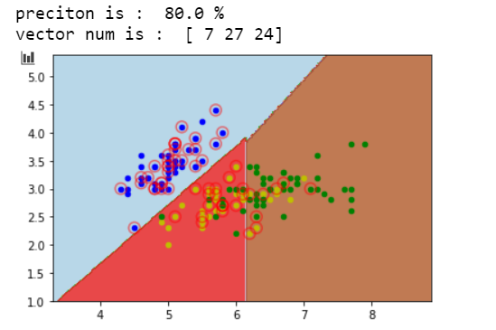

# 支持向量机SVM

逻辑回归是基于似然度的分类方法，通过对数据建模得到软输出；而支持向量机属于基于判别式的硬输出分类方法。

支持向量机并不关心数据的概率，而是基于判别式找到最优的超平面作为二分类问题的决策边界。简单来说就是**能走直线就别兜弯子**。

不要引入更复杂的问题为解决当前问题的中间步骤。
——弗拉基米尔·瓦普尼克（SVM发明者）
在SVM中，估算数据的概率分布就是那个作为中间步骤的复杂问题。SVM是基于几何意义的**非线性二分类器**。

## 1、硬间隔
### SVM-统计学习基础
#### 1）基本概念：
- <code>最小间距超平面：所有样本到平面的距离最小</code>。
- 距离度量：函数间隔和几何间隔。
函数间隔与法向量$w$和$b$有关，$w$变为$2w$则函数间距变大了，于是提出了几何距离，就是对$w$处理，除以$||w||$，除以向量长度，从而让几何距离不受影响。
- 最大间隔
 假设超平面公式是：$w^{T}x+b=0$
 支持向量机要求所有样本到超平面的距离都大于$\gamma$，求的是$\gamma$的最大值，这样就得到了如下的最优化问题：
 $$w^{T}x+b=0$$
$$
\max \limits_{w,b}   \quad  \gamma \\
s.t. \quad y_i(\frac{w}{||w||}x_i+\frac{b}{||w||}) > \gamma
$$
- 支持向量：正负样本最近的两个点，这两个点之间的距离就是$\gamma$。

那么问题来了，这中间的超平面有无数个，如何确定这个超平面呢？于是我们可以约束这个超平面到两个最近的点的距离是一样的。

上图中两个红色菱形点与一个蓝色实心圆点就是**支持向量**。
通过这个求解目标，以及约束条件来求解这个超平面。

通过一个例子来看看：

这里例子中有$w_1,w_2$，这是因为坐标点是二维的，相当于样本特征是两个，分类的结果是这两个特征的结果标签，所以这里的$w$就是一个二维的，说明在具体的应用里需要根据特征来确定$w$的维度。

#### 2）对偶讲解
原始问题是这样的：
$$
\max \limits_{w,b}   \quad  \gamma \\
s.t. \quad y_i(\frac{w}{||w||}x_i+\frac{b}{||w||}) > \gamma
$$
利用几何距离与函数距离的关系$\gamma = \frac{\hat{ \gamma}}{||w||}$将公式改为：
$$
\max \limits_{w,b}   \quad   \frac{\hat{ \gamma}}{||w||} \\
s.t. \quad y_i(wx_i+b) > \hat{\gamma}
$$
函数间隔会随着$w与b$的变化而变化，同时将$w与b$变成$\lambda w与\lambda b$，则函数间隔也会变成$\lambda  \gamma$，所以书中直接将$\gamma=1$来转换问题。同样的问题又改为：
$$
\max \limits_{w,b}   \quad   \frac{1}{||w||} \\
s.t. \quad y_i(wx_i+b) >1
$$
求解最大值改为另一个问题，求解最小值：
$$
\min   \quad   \frac{1}{2} ||w||^2 \\
s.t. \quad y_i(wx_i+b) >1 
$$
这就是一个对偶问题的例子，也是书中支持向量机模型的一个目标函数转换的过程。
对偶问题将原问题转化为凸优化问题，便于求解。

## 2、软间隔
硬间隔是方便用来分隔线性可分的数据，如果样本中的数据是**线性不可分**的呢？也就是如图所示：

有一部分红色点在绿色点那边，绿色点也有一部分在红色点那边，无法找到一条直线能把两种颜色的点完全区分开，所以就不满足上述的约束条件：$s.t. \quad y_i(x_i+b) >1$，

**软间隔**的最基本含义同硬间隔比较区别在于<code>允许某些样本点不满足原约束</code>，从直观上来说，也就是<code>“包容”了那些不满足原约束的点</code>。软间隔对约束条件进行改造，迫使某些不满足约束条件的点作为**损失函数**，如图所示：


<code>这里要区别非线性情况，非线性的意思就是一个圆圈，圆圈里是一个分类结果，圆圈外是一个分类结果。这就是非线性的情况</code>。

其中当样本点不满足约束条件时，损失是有的，但是满足条件的样本都会被置为0，这是因为加入了转换函数，使得求解$min$的条件会**专注在不符合条件的样本节点上**。

引入松弛变量，使得一部分异常数据也可以满足约束条件：$y_i(x_i+b) >=1 - \varepsilon_i$，既然约束条件引入了松弛变量，那么点到超平面的距离也要改变，于是调整为：
$$
\min   \quad   \frac{1}{2} ||w||^2+C\sum_{i}^{N}\varepsilon_i \\
s.t. \quad y_i(x_i+b) \ge 1 - \varepsilon_i \qquad  \text{i=1,2...,n}\\
\varepsilon_i  \ge 0
$$
- C：表示惩罚因子，这个值大小表示对误分类数据集的惩罚，调和最大间距和误分类点个数之间的关系。
- $\varepsilon_i$：也作为代价。

这也是一个**凸二次规划**问题，可以求解得到$w$，但$b$的求解是一个区间范围,求解过程如下：
直接得到拉格朗日对偶问题：
$$
\max_{a_i>0,\mu>0} \min_{w_i,b,\varepsilon}   \quad   L(w,b,\varepsilon,a,\mu)= \frac{1}{2} ||w||^2+C\sum_{i}^{N}\varepsilon_i+\sum_{i=1}^{N}a_{i}[1-y_i(wx_i+b)+\varepsilon_i]+\sum_{i}^{N} \mu_i \varepsilon_i
$$
继续按照流程走：
- 对w、b、$\varepsilon$ 求偏导，让偏导等于0，结果为：
$$
w = \sum_{i}a_iy_ix_i \\
\sum_{i}a_iy_i = 0 \\
C-a_i-u_i =0
$$
- 代入上面的方程得到：

$$
\max_{a_i>0,\mu>0} \quad  L(w,b,\varepsilon,a,\mu) =  -\frac{1}{2}\sum_{i} \sum_{j}a_{i}a_{j}y_{i}y_{j}(x_i * x_j) + \sum_{i}a_i \\
s.t. \quad  \sum_{i}^{N}a_iy_i=0 \\
\quad  0\le a_i\le C
$$
去掉符号，将$max$转换为$min$：
$$
\min_{a_i>0,\mu>0} \quad  L(w,b,\varepsilon,a,\mu) =  \frac{1}{2}\sum_{i} \sum_{j}a_{i}a_{j}y_{i}y_{j}(x_i * x_j) - \sum_{i}a_i \\
s.t. \quad  \sum_{i}^{N}a_iy_i=0 \\
\quad  0\le a_i\le C
$$
这里代入之后就只有一个因子$a_i$，对此方程求解$a_i$
- $w、b$:
$$
w = \sum_{i}a_iy_ix_i \\
$$
$b$的计算就需要思考了，选取满足$\quad  0\le a_i\le C$ 的 $a_i$，利用这些点来求解$b$：
$$
b = y_j-\sum_{i}a_iy_i(x_i*x_j)
$$
当然符合这个条件的也不只有一个，存在多个条件。求解平均值作为一个唯一值。

- 超平面
$$
y = wx+b
$$

和硬间隔最大化的线性可分SVM相比，多了一个约束条件：$0\le a_i \le C$。


这里思考一个问题：既然是线性不可分，难道最后求出来的支持向量就不是直线？某种意义上的直线？
其实还是直线，不满足条件的节点也被错误的分配了，只是尽可能的求解最大间隔。

## 3、核函数
引入核函数可以解决非线性的情况：<font color="#F00">将样本从原始空间映射到一个更高为的特征空间，使得样本在这个特征空间内线性可分</font>。

**最理想的情况下，我们希望知道数据的具体形状和分布，从而得到一个刚好可以将数据映射成线性可分的$ϕ(⋅)$，然后通过这个$ϕ(⋅)$得出对应的$κ(⋅,⋅)$进行内积计算。然而，第二步通常是非常困难甚至完全没法做的。不过，由于第一步也是几乎无法做到，因为对于任意的数据分析其形状找到合适的映射本身就不是什么容易的事情，所以，人们通常都是“胡乱”选择映射的，所以，根本没有必要精确地找出对应于映射的那个核函数，而只需要“胡乱”选择一个核函数即可——我们知道它对应了某个映射，虽然我们不知道这个映射具体是什么。由于我们的计算只需要核函数即可，所以我们也并不关心也没有必要求出所对应的映射的具体形式。**

### 常用的核函数及对比：
- $Linear$  $Kernel$线性核
   $$k(x_i,x_j)=x_i^{T}x_j$$
  线性核函数是最简单的核函数，主要用于线性可分，它在原始空间中寻找最优线性分类器，具有参数少速度快的优势。 如果我们将线性核函数应用在$KPCA$中，我们会发现，推导之后和原始$PCA$算法一模一样，这只是线性核函数偶尔会出现等价的形式罢了。
- $Polynomial$ $Kernel$多项式核
$$k(x_i,y_j)=(x_i^{T}x_j)^d$$
也有复杂的形式：
$$k(x_i,x_j)=(ax_i^{T}x_j+b)^d$$
其中$d\ge1$为多项式次数，参数就变多了，多项式核实一种非标准核函数，它非常适合于正交归一化后的数据，多项式核函数属于全局核函数，可以实现低维的输入空间映射到高维的特征空间。其中参数$d$越大，映射的维度越高，和矩阵的元素值越大。故易出现过拟合现象。
- 径向基函数 高斯核函数 $Radial$ $Basis$ $Function（RBF）$
$$k(x_i,x_j)=exp(-\frac{||x_i-x_j||^2}{2\sigma^2})$$
 $\sigma>0$是高斯核带宽，这是一种经典的鲁棒径向基核，即高斯核函数，鲁棒径向基核对于数据中的噪音有着较好的抗干扰能力，其参数决定了函数作用范围，超过了这个范围，数据的作用就“基本消失”。高斯核函数是这一族核函数的优秀代表，也是必须尝试的核函数。对于大样本和小样本都具有比较好的性能，因此在多数情况下不知道使用什么核函数，优先选择径向基核函数。
- $Laplacian$ $Kernel$拉普拉斯核
$$k(x_i,x_j)=exp(-\frac{||x_i-x_j||}{\sigma})$$
- $Sigmoid$ $Kernel$ $Sigmoid$核
$$k(x_i,x_j)=tanh(\alpha x^Tx_j+c)$$
采用$Sigmoid$核函数，支持向量机实现的就是一种多层感知器神经网络。

其实还有很多核函数，在参考博客里大家都可以看到这些核函数，对于核函数如何选择的问题，吴恩达教授是这么说的：
- 如果$Feature$的数量很大，跟样本数量差不多，这时候选用$LR$或者是$Linear$ $Kernel$的$SVM$
- 如果$Feature$的数量比较小，样本数量一般，不算大也不算小，选用$SVM$ +$Gaussian$ $Kernel$
- 如果$Feature$的数量比较小，而样本数量很多，需要手工添加一些$feature$变成第一种情况

## 4、SMO求解SVM
思想：通过观察SVM的优化目标我们可以发现其最终的目的是要计算出一组最优的$\alpha$和常数项$b$的值。SMO算法的中心思想就是每次选出两个$\alpha$进行优化（之所以是两个是因为$\alpha$的约束条件决定了其与标签乘积的累加等于0，因此必须一次同时优化两个，否则就会破坏约束条件），然后固定其他的$\alpha$值。重复此过程，直到达到某个终止条件程序退出并得到我们需要的优化结果。

具体求解可以参考[https://www.jianshu.com/p/eef51f939ace](https://www.jianshu.com/p/eef51f939ace)


## 5、代码实现
```python
from sklearn import svm
from sklearn.svm import SVC
from sklearn.datasets import load_iris
import matplotlib.pyplot as plt
import numpy as np
from sklearn.model_selection import train_test_split
from sklearn.model_selection import GridSearchCV
```

```python
def plot_point2(dataArr, labelArr, Support_vector_index):
    for i in range(np.shape(dataArr)[0]):
        if labelArr[i] == 0:
            plt.scatter(dataArr[i][0], dataArr[i][1], c='b', s=20)
        elif labelArr[i] == 1:
            plt.scatter(dataArr[i][0], dataArr[i][1], c='y', s=20)
        else:
            plt.scatter(dataArr[i][0], dataArr[i][1], c='g', s=20)
    
    for j in Support_vector_index:
        plt.scatter(dataArr[j][0], dataArr[j][1], s=100, c='',alpha=0.5, linewidth=1.5, edgecolor='red')
    plt.show()
 
if __name__ == "__main__":
    iris = load_iris()
    x, y = iris.data, iris.target
    x = x[:, :2]
    X_train, X_test, y_train, y_test = train_test_split(x, y, test_size=0.3, random_state=0)
    clf = SVC(C=1, cache_size=200, class_weight=None, coef0=0.0, decision_function_shape='ovr', degree=3, gamma=0.1, kernel='linear', max_iter=-1, probability=False, random_state=None, shrinking=True, tol=0.001, verbose=False)
    clf.fit(X_train, y_train)
 
    predict_list = clf.predict(X_test)
 
    precition = clf.score(X_test, y_test)
    print("preciton is : ", precition * 100, "%")
 
    n_Support_vector = clf.n_support_
    print("vector num is : ", n_Support_vector)
    Support_vector_index = clf.support_
 
    x_min, x_max = x[:, 0].min() - 1, x[:, 0].max() + 1
    y_min, y_max = x[:, 1].min() - 1, x[:, 1].max() + 1
    h = 0.02
    xx, yy = np.meshgrid(np.arange(x_min, x_max, h), np.arange(y_min, y_max, h))
    Z = clf.predict(np.c_[xx.ravel(), yy.ravel()])
    Z = Z.reshape(xx.shape)
    plt.contourf(xx, yy, Z, cmap=plt.cm.Paired, alpha=0.8)
    plot_point2(x, y, Support_vector_index)
```


## 6、参考博客
[统计学习基础]()
[支持向量机SVM：原理讲解+手写公式推导+疑惑分析](https://blog.csdn.net/randompeople/article/details/90020648)
[支持向量机 - 软间隔最大化](https://blog.csdn.net/randompeople/article/details/104031825)
[使用SVM对鸢尾花数据集进行分类](blog.csdn.net/z345436330/article/details/89005868)