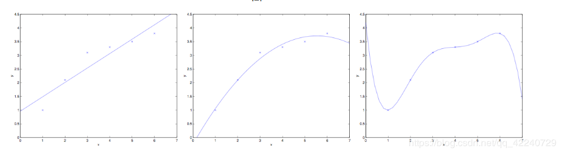
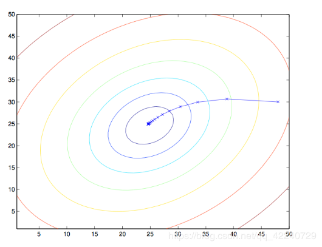
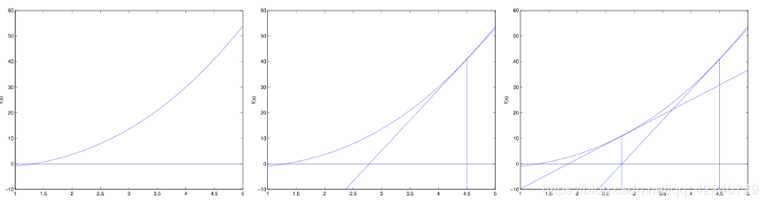

# Linear Regression

## 1、模型建立：线性回归原理、线性回归模型
### （1）线性回归原理
进入一家房产网，可以看到房价、面积、厅室的数据：

| 面积($x_1$) | 厅室数量($x_2$) | 价格(万元)(y) |
| ------ | ------ | ------ |
| 64 | 3 | 225 |
| 59 | 3 | 185 |
| 65 | 3 | 208 |
| 116 | 4 | 508 |
| …… | …… | …… |
可以将房价、面积和厅室的关系拟合成$f(x)=\theta_0+\theta_1x_1+\theta_2x_2$，使得$f(x)\approx y$，这就是一个直观的线性回归的样式。

### （2）线性回归模型
有数据集$\{(x_1,y_1),(x_2,y_2),...,(x_n,y_n)\}$,其中,$x_i = (x_{i1};x_{i2};x_{i3};...;x_{id}),y_i\in R$<br> ，其中n表示变量的数量，d表示每个变量的维度。  
可以用以下函数来描述y和x之间的关系：
$$ f(x) = \theta_0 + \theta_1x_1 + \theta_2x_2 + ... + \theta_dx_d = \sum_{i=0}^{d}\theta_ix_i $$
我们需要确定$\theta$的值，使得$f(x)$尽可能接近y的值。
均方误差是回归中常用的性能度量，即：
$$J(\theta)=\frac{1}{2}\sum_{i=1}^{n}(h_{\theta}(x^{(i)})-y^{(i)})^2$$

### （3）为什么要用均方误差——极大似然估计（从概率角度诠释）
可以把目标值和变量写成如下形式：
$$y^{(i)} = \theta^T x^{(i)}+\epsilon^{(i)}$$
其中，$\epsilon$ 表示我们未观测到的变量的印象，即随机噪音。根据中心极限定理，
$\epsilon$独立同分布，服从高斯分布。
$$p(\epsilon^{(i)}) = \frac{1}{\sqrt{2\pi}\sigma}exp\left(-\frac{(\epsilon^{(i)})^2}{2\sigma^2}\right)$$
因此，
$$p(y^{(i)}|x^{(i)};\theta) =
\frac{1}{\sqrt{2\pi}\sigma}exp\left(-\frac{(y^{(i)}-\theta^T
x^{(i)})^2}{2\sigma^2}\right)$$

建立极大似然函数，
$$ L(\theta) = p(\vec y | X;\theta) =
\prod^n_{i=1}\frac{1}{\sqrt{2\pi}\sigma}exp\left(-\frac{(y^{(i)}-\theta^T
x^{(i)})^2}{2\sigma^2}\right) $$
取对数，
$$l(\theta) = log L(\theta) = log \prod^n_{i=1}\frac{1}{\sqrt{2\pi}\sigma}exp\left(-\frac{(y^{(i)}-\theta^T x^{(i)})^2} {2\sigma^2}\right)  = \sum^n_{i=1}log\frac{1}{\sqrt{2\pi}\sigma}exp\left(-\frac{(y^{(i)}-\theta^T x^{(i)})^2}{2\sigma^2}\right)  = nlog\frac{1}{{\sqrt{2\pi}\sigma}} - \frac{1}{\sigma^2} \cdot \frac{1}{2}\sum^n_{i=1}((y^{(i)}-\theta^T x^{(i)})^2$$
显然，最大化$l(\theta)$即最小化 $\frac{1}{2}\sum^n_{i=1}((y^{(i)}-\theta^T x^{(i)})^2$，这个结果就是均方误差，因此用均方误差作为代价函数来优化模型是合理的。

## 2、学习策略：线性回归损失函数、代价函数、目标函数
### （1）损失函数(Loss Function)：度量单样本预测的错误程度，损失函数值越小，模型就越好。
常用的损失函数包括：0-1损失函数、平方损失函数、绝对损失函数、对数损失函数、hinge损失函数等。
#### a.0-1损失函数
$$L(y,f(x))=\begin{cases}1&y\not=f(x)\\0&y=f(x)\end{cases}$$
当预测错误时，损失函数为1；当预测正确时，损失函数为0。

#### b.平方损失函数
$$L(y,f(x))=\left(y-f(x)\right)^2$$

#### c.绝对损失函数
$$L(y,f(x))=\left|y-f(x)\right|$$

#### d.对数损失函数
$$L(y,p(y|x))=−logp(y|x)$$
这里运用了极大似然的思想。$p(y|x)$可以理解为对于样本X，其预测值为Y，也就是预测正确的概率。为了便于计算，通过取对数转化为加法。另外，预测正确的概率越高，损失函数的值应该是越小，所以加个负号取倒数。

#### e.hinge loss
hinge 损失函数一般用于分类算法，尤其是SVM，定义为：
$$L(w,b)=max\left({0,1-yf(x)}\right)$$
其中$y=+1$或$y=-1$,$f(x)=wx+b$，当为SVM的线性核时。

### （2）代价函数(Cost Function)：度量全部样本集的平均误差。
常用的代价函数包括均方误差、均方根误差、平均绝对误差、交叉熵代价等。
#### a.均方误差
$$J(\theta)=\frac{1}{N}\sum_{i=1}^{n}(h_{\theta}(x^{(i)})-y^{(i)})^2$$

#### b.均方根误差
$$J(\theta)=\frac{1}{N}\sqrt{\sum_{i=1}^{n}(h_{\theta}(x^{(i)})-y^{(i)})^2}$$

#### c.平均绝对误差
$$J(\theta)=\frac{1}{N}\sum_{i=1}^{n}\|h_{\theta}(x^{(i)})-y^{(i)}\|$$

#### d.交叉熵代价
$$J(\theta)=-\frac{1}{N}\sum_{i=1}^{n}p(x^{(i)})logq(x^{(-i)})$$
参考：https://www.cnblogs.com/lliuye/p/9549881.html

### （3）目标函数(Object Function)：代价函数和正则化函数，最终要优化的函数。
目标函数=代价函数+正则化项
$$\underset{f\in F}{min}\, \frac{1}{n}\sum^{n}_{i=1}L(y_i,f(x_i))+\lambda J(F)$$
引入正则化项的原因：防止过拟合（“结构化风险”）


## 3、算法求解：梯度下降法、牛顿法、拟牛顿法等
### （1）梯度下降法
设定初始参数$\theta$,不断迭代，使得$J(\theta)$最小化：
$$\theta_j:=\theta_j-\alpha\frac{\partial{J(\theta)}}{\partial\theta}$$

$$\frac{\partial{J(\theta)}}{\partial\theta} =
\frac{\partial}{\partial\theta_j}\frac{1}{2}\sum_{i=1}^{n}(f_\theta(x)^{(i)}-y^{(i)})^2
\\= 2*\frac{1}{2}\sum_{i=1}^{n}(f_\theta(x)^{(i)}-y^{(i)})*\frac{\partial}{\partial\theta_j}(f_\theta(x)^{(i)}-y^{(i)})
\\= \sum_{i=1}^{n}(f_\theta(x)^{(i)}-y^{(i)})*\frac{\partial}{\partial\theta_j}(\sum_{j=0}^{d}\theta_jx_j^{(i)}-y^{(i)}))
\\= \sum_{i=1}^{n}(f_\theta(x)^{(i)}-y^{(i)})x_j^{(i)}$$
即：
$$\theta_j = \theta_j + \alpha\sum_{i=1}^{n}(y^{(i)}-f_\theta(x)^{(i)})x_j^{(i)}$$
注：下标$j$表示第$j$个参数，上标$i$表示第$i$个数据点。
将所有的参数以向量形式表示，可得：
$$
\theta = \theta + \alpha\sum_{i=1}^{n}(y^{(i)}-f_\theta(x)^{(i)})x^{(i)}
$$
由于这个方法中，参数在每一个数据点上同时进行了移动，因此称为**批梯度下降法**，对应的，我们可以每一次让参数只针对一个数据点进行移动，即：
$$
\theta = \theta + \alpha(y^{(i)}-f_\theta(x)^{(i)})x^{(i)}
$$
这个算法称为随机梯度下降法。随机梯度下降法的好处是，当数据点很多时，运行效率更高；缺点是，因为每次只针对一个样本更新参数，未必找到最快路径达到最优值，甚至有时候会出现参数在最小值附近徘徊而不是立即收敛。但当数据量很大的时候，随机梯度下降法经常优于批梯度下降法。

当$J$为凸函数时，梯度下降法相当于让参数$θ$不断向$J$的最小值位置移动。

梯度下降法的缺陷：如果函数为非凸函数，有可能找到的并非全局最优值，而是**局部最优值**。

最小二乘法的矩阵求解
$$
 X = \left[
 \begin{matrix}
   (x^{(1)})^T\\
   (x^{(2)})^T\\
   \vdots\\
   (x^{(n)})^T
  \end{matrix}
  \right]
$$
其中，
$$
 x^{(i)} = \left[
 \begin{matrix}
   x_1^{(i)}\\
   x_2^{(i)}\\
   \vdots\\
   x_d^{(i)}
  \end{matrix}
  \right]
$$
由于
$$
 Y = \left[
 \begin{matrix}
   y^{(1)}\\
   y^{(2)}\\
   \vdots\\
   y^{(n)}
  \end{matrix}
  \right]
$$
$h_\theta(x)$可以写作$h_\theta(x)=X\theta$,对于向量来说，有$z^Tz = \sum_i
z_i^2$,因此可以把损失函数写作
$$J(\theta)=\frac{1}{2}(X\theta-Y)^T(X\theta-Y)$$
为最小化$J(\theta)$,对$\theta$求导可得：
$$
\frac{\partial  J(\theta)}{\partial \theta} = \frac{\partial}{\partial\theta}
\frac{1}{2}(X\theta-Y)^T(X\theta-Y) \\=
\frac{1}{2}\frac{\partial}{\partial\theta} (\theta^TX^TX\theta -
Y^TX\theta-\theta^T X^TY - Y^TY)
$$

中间两项互为转置，由于求得的值是个标量，矩阵与转置相同，因此可以写成
$$
\frac{\partial{J(\theta)}}{\partial\theta} 
= \frac{1}{2}\frac{\partial}{\partial\theta} (\theta^TX^TX\theta - 2\theta^T X^TY - Y^TY) $$
令偏导数等于零，由于最后一项和$\theta$无关，偏导数为0。
利用矩阵求导性质，
$$
\frac{\partial \vec x^T\alpha}{\partial \vec x} =\alpha 
$$
和
$$\frac{\partial A^TB}{\partial \vec x} = \frac{\partial A^T}{\partial \vec x}B+ \frac{\partial B^T}{\partial \vec x}A$$

$$
\frac{\partial}{\partial\theta} \theta^TX^TX\theta 
= \frac{\partial}{\partial\theta}{(X\theta)^TX\theta}
= \frac{\partial (X\theta)^T}{\partial\theta}X\theta + \frac{\partial (X\theta)^T}{\partial\theta}X\theta
= 2X^TX\theta
$$

令导数等于零，
$$X^TX\theta = X^TY$$
$$\theta = (X^TX)^{-1}X^TY$$
### （2）牛顿法

通过图例可知(参考吴恩达CS229),
$$f(\theta)' = \frac{f(\theta)}{\Delta},\Delta =
\theta_0 - \theta_1$$
可求得，
$$\theta_1 = \theta_0 - \frac {f(\theta_0)}{f(\theta_0)'}$$
重复迭代，可以让逼近取到$f(\theta)$的最小值。
当我们对损失函数$l(\theta)$进行优化的时候，实际上是想要取到$l'(\theta)$的最小
值，因此迭代公式为：
$$\theta :=\theta-\frac{l'(\theta)}{l''(\theta)}$$
当$\theta$是向量值的时候，
$$\theta :=\theta - H^{-1}\Delta_{\theta}l(\theta)$$
其中，$\Delta_{\theta}l(\theta)$是$l(\theta)$对$\theta_i$的偏导数，$H$是$J(\theta)$的海森矩阵，<br>
$$H_{ij} = \frac{\partial ^2l(\theta)}{\partial\theta_i\partial\theta_j}$$

Q：请用泰勒展开法推导牛顿法公式。
A：将$f(x)$用泰勒公式展开到第二阶，$f(x) = f(x_0) + f'(x_0)(x - x_0)+\frac{1}{2}f''(x_0)(x - x_0)^2$，对上式求导，并令导数等于0，求得x值，可以求得
$$x = x_0 - \frac{f'(x_0)}{f''(x_0)} $$

牛顿法的收敛速度非常快，但海森矩阵的计算较为复杂，尤其当参数的维度很多时，会耗费大量计算成本。我们可以用其他矩阵替代海森矩阵，用**拟牛顿法**进行估计。

### （3）拟牛顿法
思路：用一个矩阵替代计算复杂的海森矩阵H，因此要找到符合H性质的矩阵。
要求得海森矩阵符合的条件，同样对泰勒公式求导$f'(x) = f'(x_0) + f''(x_0)x -f''(x_0)x_0$
令$x = x_1$，即迭代后的值，代入可得：
$$f'(x_1) = f'(x_0) + f''(x_0)x_1 - f''(x_0)x_0$$
更一般地，$$f'(x_{k+1}) = f'(x_k) + f''(x_k)x_{k+1} - f''(x_k)x_k$$
$$f'(x_{k+1}) - f'(x_k)  = f''(x_k)(x_{k+1}- x_k)= H(x_{k+1}- x_k)$$
$x_k$为第k个迭代值，即找到矩阵G，使得它符合上式。
常用的拟牛顿法的算法包括DFP，BFGS等。

## 4、线性回归的评估指标
### （1）均方误差 
$MSE = \frac{1}{m}\sum^{m}_{i=1}(y^{(i)} - \hat y^{(i)})^2$

### （2）均方根误差
$RMSE = \sqrt{MSE} = \sqrt{\frac{1}{m}\sum^{m}_{i=1}(y^{(i)} - \hat y^{(i)})^2}$

### （3）平均绝对误差
$MAE = \frac{1}{m}\sum^{m}_{i=1} | (y^{(i)} - \hat y^{(i)} | $

### (4) $R^2$
$$R^2: = 1-\frac{\sum^{m}_{i=1}(y^{(i)} - \hat y^{(i)})^2}{\sum^{m}_{i=1}(\bar y - \hat y^{(i)})^2} =1-\frac{\frac{1}{m}\sum^{m}_{i=1}(y^{(i)} - \hat y^{(i)})^2}{\frac{1}{m}\sum^{m}_{i=1}(\bar y - \hat y^{(i)})^2} = 1-\frac{MSE}{VAR}$$
$R^2$可以避免量纲不一致，可以理解为回归模型可以成功解释的数据方差部分在数据固有方差中所占的比例，$R^2$越接近1，表示可解释力度越大，模型拟合的效果越好。

## 5、sklearn参数详解
### （1）调用方法
先定义一个线性回归对象
```python
lr = sklearn.linear_model.LinearRegression(fit_intercept=True, normalize=False, copy_X=True, n_jobs=1)
```

### （2）参数介绍
- fit_intercept:默认为True,是否计算该模型的截距。如果使用中心化的数据，可以考虑设置为False,不考虑截距。注意这里是考虑，一般还是要考虑截距
normalize: 默认为false. 当fit_intercept设置为false的时候，这个参数会被自动忽略。如果为True,回归器会标准化输入参数：减去平均值，并且除以相应的二范数。当然啦，在这里还是建议将标准化的工作放在训练模型之前。通过设置sklearn.preprocessing.StandardScaler来实现，而在此处设置为false
- copy_X : 默认为True, 否则X会被改写
- n_jobs: int 默认为1. 当-1时默认使用全部CPUs ??(这个参数有待尝试)

### （3）可用属性
- coef_:训练后的输入端模型系数，如果label有两个，即y值有两列。那么是一个2D的array
- intercept_: 截距

### （4）可用的methods
- fit(X,y,sample_weight=None):
  - X: array, 稀疏矩阵 [n_samples,n_features]
  - y: array [n_samples, n_targets]
  - sample_weight: 权重 array [n_samples]
  - 在版本0.17后添加了sample_weight

- get_params(deep=True)：返回对regressor的设置值

- predict(X): 预测 基于$R^2$值

- score： 评估
参考：https://blog.csdn.net/weixin_39175124/article/details/79465558

## 6、练习部分
### 练习题
自行生成数据集
1、首先尝试调用sklearn的线性回归函数进行训练；
2、用最小二乘法的矩阵求解法训练数据；
3、用梯度下降法训练数据；
4、比较各方法得出的结果是否一致。

```python
# 生成数据
import numpy as np
np.random.seed(21)
x = np.random.rand(500, 3)
y = x.dot(np.array([3.5, 2.5, 8.9]))
# 构建映射关系，模拟真实的数据待预测值，映射关系为y = 3.5 + 2.5 * x1 + 8.9 * x2
```

1、先尝试调用sklearn的线性回归模型训练数据
```python
# 调用sklearn的线性回归模型训练数据
import numpy as np
from sklearn.linear_model import LinearRegression 
import matplotlib.pyplot as plt 
%matplotlib inline
```

```python
# 调用模型
lr = LinearRegression(fit_intercept=True)
# 训练模型
lr.fit(x,y)
print("估计的参数值为：%s" %(lr.coef_))
# 计算R平方
print('R2:%s' %(lr.score(x,y)))
# 任意设定变量，预测目标值
x_test = np.array([2,4,5]).reshape(1,-1)
y_hat = lr.predict(x_test)
print("预测值为: %s" %(y_hat))
```

输出：
```
估计的参数值为:[3.5 2.5 8.9]
R2:1.0
预测值为：[61.5]
```
Q：为什么$R^2$为1？拟合结果这么好？
A：因为没有加白噪声，数据本身就是线性关系。

2、最小二乘法的矩阵求解
```python
# 最小二乘法的矩阵求解
class LR_LS():
    def __init__(self):
        self.w = None
    def fit(self, X, y):
        # 最小二乘法矩阵求解
        self.w = np.linalg.inv(X.T.dot(X)).dot(X.T).dot(y)
    def predict(self, X):

        # yongyyyo用已经拟合的参数值预测新自变量
        y_pred = X.dot(self.w)
        return y_pred
        
if __name__ == '__main__':
    lr_ls = LR_LS()
    lr_ls.fit(x,y)
    print('估计的参数值： %s' %(lr_ls.w))
    x_test = np.array([2, 4, 5]).reshape(1, -1)
    print('预测值为： %s' %(lr_ls.predict(x_test)))
```

输出：
```
估计的参数值： [3.5 2.5 8.9]
预测值为： [61.5]
```

3、梯度下降法
```python
# 梯度下降法
class LR_GD():
    def __init__(self):
        self.w = None
    def fit(self, X, y, alpha=0.02, loss=1e-10):
        #设定步长为0.002，判断是否收敛的条件为1e-10
        y = y.reshape(-1, 1) # 重塑y的维度以便矩阵运算
        [m, d] = np.shape(X) # 自变量的维度
        self.w = np.zeros((d)) # 将参数的初始值定为0
        tol = 1e5
        while tol > loss:
            h_f = X.dot(self.w).reshape(-1, 1)
            theta = self.w + alpha * np.mean(X *(y - h_f), axis=0) # 计算迭代的参数值
            tol = np.sum(np.abs(theta - self.w))
            self.w = theta
    def predict(self, X):
        # 用已经拟合的参数值预测新自变量
        y_pred = X.dot(self.w)
        return y_pred

if __name__ == '__main__':
    lr_gd = LR_GD()
    lr_gd.fit(x,y)
    print('估计的参数值为：%s' %(lr_gd.w))
    x_test = np.array([2, 4, 5]).reshape(1, -1)
    print('预测值为：%s' %(lr_gd.predict(x_test)))               
```

输出：
```
估计的参数值为：[3.49999998 2.50000003 8.89999999]
预测值为：[61.50000001]
```
4、用sklearn的线性回归函数进行训练和用最小二乘法的矩阵求解法训练数据得出的结果是一致的，用梯度下降法训练的结果与前两种方法略有差异。

*拓展*：加入白噪声
```python
# 加入白噪声
e = np.random.normal(loc=0, scale=1, size=500)
y1 = x.dot(np.array([3.5, 2.5, 8.9])) + e

# 调用模型
lr1 = LinearRegression(fit_intercept=True)

# 训练模型
lr1.fit(x,y1)
print('估计的参数值为:%s' %(lr1.coef_))

# 计算R^2
print('R2:%s' %(lr1.score(x,y1)))

# 任意设定变量，预测目标值
x_test = np.array([2, 4, 5]).reshape(1, -1)
y1_hat = lr1.predict(x_test)
print('预测值为：%s' %(y1_hat))
```

```
估计的参数值为:[3.35673675 2.67200128 8.72474066]
R2:0.894166927491615
预测值为：[61.05771249]
```
此时$R^2$不再是1。