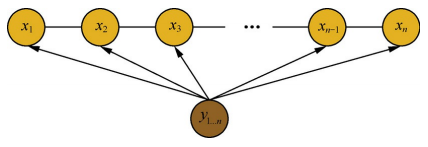

# 一、马尔可夫过程
定义：假设一个随机过程中，$t_n$ 时刻的状态$x_n$的条件发布，只与其前一状态$x_{n-1}$ 相关，即：
$$P(x_n|x_1,x_2,...,x_{n-1}) = P(x_n|x_{n-1})$$
则将其称为马尔可夫过程。


# 二、隐马尔科夫算法
## 1、定义：
隐马尔科夫算法是对含有未知参数（隐状态）的马尔可夫链进行建模的生成模型，如下图所示：


在隐马尔科夫模型中，包含隐状态和观察状态，隐状态$x_i$对于观察者而言是不可见的，而观察状态$y_i$对于观察者而言是可见的。隐状态间存在转移概率，隐状态$x_i$到对应的观察状态$y_i$间存在输出概率。

## 2、假设：
1. 假设隐状态$x_i$的状态满足马尔可夫过程，i时刻的状态$x_i$的条件分布，仅与其前一个状态$x_{i-1}$相关，即：
$$P(x_i|x_1,x_2,...,x_{i-1}) = P(x_i|x_{i-1})$$

2. 假设观测序列中各个状态仅取决于它所对应的隐状态，即：
$$P(y_i|x_1,x_2,...,x_{i-1},y_1,y_2,...,y_{i-1},y_{i+1},...) = P(y_i|x_{i})$$

## 3、存在问题：
在序列标注问题中，隐状态（标注）不仅和单个观测状态相关，还和观察序列的长度、上下文等信息相关。例如词性标注问题中，一个词被标注为动词还是名词，不仅与它本身以及它前一个词的标注有关，还依赖于上下文中的其他词。

# 三、条件随机场（以线性链条件随机场为例）
## 1、定义
给定$X=(x_1,x_2,...,x_n)$，$Y=(y_1,y_2,...,y_n)$均为**线性链**表示的随机变量序列，若在给随机变量序列$X$的条件下，随机变量序列$Y$的条件概率分布$P(Y|X)$构成条件随机场，即满足马尔可夫性：
$$P(y_i|x_1,x_2,...,x_{i-1},y_1,y_2,...,y_{i-1},y_{i+1})= P(y_i|x,y_{i-1},y_{i+1})$$
则称为$P(Y|X)$为线性链条件随机场。

通过去除了隐马尔科夫算法中的观测状态相互独立假设，使算法在计算当前隐状态$x_i$时，会考虑整个观测序列，从而获得更高的表达能力，并进行全局归一化解决标注偏置问题。



### 1）参数化形式
$$
p\left(y | x\right)=\frac{1}{Z\left(x\right)} \prod_{i=1}^{n} \exp \left(\sum_{i, k} \lambda_{k} t_{k}\left(y_{i-1}, y_{i}, x, i\right)+\sum_{i, l} \mu_{l} s_{l}\left(y_{i}, x, i\right)\right)
$$

其中：
$Z(x)$为归一化因子，是在全局范围进行归一化，枚举了整个隐状态序列$x_{1…n}$的全部可能，从而解决了局部归一化带来的标注偏置问题。

$$
Z(x)=\sum_{y} \exp \left(\sum_{i, k} \lambda_{x} t_{k}\left(y_{i-1}, y_{i}, x, i\right)+\sum_{i, l} \mu_{l} s_{l}\left(y_{i}, x, i\right)\right)
$$
$t_k$ 为定义在边上的特征函数，转移特征，依赖于前一个和当前位置
$s_1$ 为定义在节点上的特征函数，状态特征，依赖于当前位置。

### 2）简化形式
因为条件随机场中同一特征在各个位置都有定义，所以可以对同一个特征在各个位置求和，将局部特征函数转化为一个全局特征函数，这样就可以将条件随机场写成权值向量和特征向量的内积形式，即条件随机场的简化形式。

- step 1
  将转移特征和状态特征及其权值用统一的符号表示，设有$k_1$个转移特征，$k_2$个状态特征，$K=k_1+k_2$,记
$$f_k(y_{i-1},y_i,x,i)=\begin{cases}t_k(y_{i-1},y_i,x,i),\quad k = 1,2,3, ..., K_1 \\s_l(y_i,x,i), \quad k = k_1+l; l = 1, 2, ... , K_2\end{cases}$$

- step 2
对转移与状态特征在各个位置$i$求和，记作
$$f_k(y,x)=\sum_{i=1}^nf_k(y_{i-1},y_i,x,i),k=1,2,...,K$$

- step 3
 将 $\lambda_{x}$ 和 $\mu_{l}$ 用统一的权重表示，记作
$$w_k = \begin{cases}\lambda_k, \quad k = 1, 2, ..., K_1 \\\mu_l, \quad k = K_1+l; l = 1, 2, ..., K_2\end{cases}$$

- step 4
  转化后的条件随机场可表示为：
$$P(y|x)=\frac{1}{Z(x)}exp\sum_{k=1}^{K}w_kf_k(y,x)$$
$$Z(x)=\sum_yexp\sum_{k=1}^Kw_kf_k(y,x)$$

- step 5
若 $w$ 表示权重向量：
$$w = (w_1,w_2,...,w_K)^T$$
以 $F(y,x)$ 表示特征向量，即
$$F(y,x)=(f_1(y|x),f_2(y|x),...,f_K(y|x))^T$$

则，条件随机场写成内积形式为：
$$P_w(y|x)=\frac{exp(w\cdot F(y,x)}{Z_w(x)}$$
$$Z_w(x)=\sum_yexp(w\cdot F(y,x))$$

### 3）矩阵形式
$$P_w(y|x)=\frac{1}{Z_w(x)}\prod_{i=1}^{n+1}M_i(y_{i-1},y_i|x)$$

## 2、基本问题
条件随机场包含概率计算问题、学习问题和预测问题三个问题。

- 1. 概率计算问题：已知模型的所有参数，计算观测序列$Y$出现的概率，常用方法：前向和后向算法；

- 2. 学习问题：已知观测序列$Y$,求解使得该观测序列概率最大的模型参数，包括隐状态序列、隐状态间的转移概率分布和从隐状态到观测状态的概率分布，常用方法：$Baum-Wehch$算法；

- 3. 预测问题：一直模型所有参数和观测序列$Y$，计算最可能的隐状态序列$X$,常用算法：维特比算法。
  
### 1）概率计算问题
给定条件随机场$P(Y|X)$，输入序列 $x$ 和 输出序列 $y$;
计算条件概率
$$P(Y_i=y_i|x), P(Y_{i-1} = y_{i-1},Y_i = y_i|x)$$
计算相应的数学期望问题；

#### ①前向-后向算法
- step 1 前向计算
对观测序列$x$的每个位置 $i=1,2,...,n+1$，定义一个$m$阶矩阵（$m$为标记$Y_i$取值的个数）

对每个指标 $i=0,1,...,n+1$，定义前向向量 $\alpha_{i}(x)$，则递推公式:
$$\alpha_i^T(y_i|x)=\alpha_{i-1}^T(y_{i-1}|x)M_i(y_{i-1},y_i|x),i=1,2,..,n+1$$
其中，
$$\alpha_0(y|x) = \begin{cases}1, \quad y = start \\0, \quad 否则\end{cases}$$ 

- step 2 后向计算
对每个指标 $i=0,1,...,n+1$，定义前向向量 $\beta_{i}(x)$，则递推公式:
$$\beta _{n+1}(y_{n+1}|x) = \begin{cases}1, \quad y_{n+1} = stop \\0, \quad 否则\end{cases}$$
$$\beta _i(y_i|x) =M_i(y_i,y_{i+1}|x)\beta_{i-1}(y_{i+1}|x)$$

- step 3
$$Z(x)=\alpha_n^T(x)\cdot 1=1^T\cdot\beta_1(x)$$

- step 4 概率计算
所以，标注序列在位置$i$是标注$y_i$的条件概率为：
$$P(Y_i=y_i|x)=\frac{\alpha_i^T(y_i|x)\beta_i(y_i|x)}{Z(x)}$$
$$P(Y_{i-1}=y_{i-1},{Y_i}=y_i|x)=\frac{\alpha_{i-1}^T(y_{i-1}|x)M_i(y_{i-1},y_i|x)}{Z(x)}$$
其中，
$$Z(x)=\alpha_n^T(x)\cdot1$$

- step 5 期望值计算
通过利用前向-后向向量，计算特征函数关于联合概率分布 $P(X,Y)$ 和 条件概率分布 $P(Y|X)$ 的数学期望，即特征函数 $f_k$ 关于条件概率分布 $P(Y|X)$ 的数学期望：
$$E_{P(Y|X)}[f_k]=\sum_yP(y|x)f_k(y,x)\\=\sum_{i=1}^{n+1}\sum_{y_{i-1}y_i}f_k(y_{i-1},y_i,x,i)\frac{\alpha_{i-1}^T(y_{i-1}|x)M_i(y_{i-1},y_i|x)\beta_i(y_i|x)}{Z(x)}\\k=1,2,...,K$$
其中：
$$M_i(x)=[M_i(y_{i-1},y_i|x)]\\M_i(y_{i-1},y_i|x)=exp(W_i(y_{i-1},y_i|x))\\W_i(y_{i-1},y_i|x)=\sum_{i=1}^Kw_kf_k(y_{i-1},y_i,x,i))$$

### 2）学习问题
这里主要介绍一下 BFGS 算法的思路。

   输入：特征函数 $f_1,f_2,...,f_n$：经验分布 $\widetilde{P}(X,Y)$；
   
   输出：最优参数值 $\widehat{w}$，最优模型$P_{\widehat{w}}(y|x)$。
   
   1. 选定初始点 $w^{(0)}$， 取 $B_0$ 为正定对称矩阵，$k = 0$;
   2. 计算 $g_k = g(w^(k))$，若 $g_k = 0$ ，则停止计算，否则转 (3) ；
   3. 利用 $B_k p_k = -g_k$ 计算 $p_k$；
   4. 一维搜索：求 $\lambda_k$使得
   $$f(w^{(k)}+\lambda_kp_k)=min_{\lambda>0}f(w^{(k)}+\lambda p_k)$$
   5. 设 $w^{(k+1)} = w^{(k)} + \lambda_k * p_k$
   6. 计算 $g_{k+1}$ = g(w^{(k+1)}),
   
       若 $g_k = 0$， 则停止计算；否则，利用下面公式计算 $B_{k+1}$:
       
       $$B_{k+1}=B_k+\frac{y_ky_k^T}{y_k^T\delta_k}-\frac{B_k\delta_k\delta_k^TB_k}{\delta_k^TB_k\delta_k}\\y_k=g_{k+1}-g_k,\delta_k=w^{(k+1)}-w^{(k)}$$
       
   7. 令 $k=k+1$，转步骤（3）；

### 3）预测问题
对于预测问题，常用的方法是维特比算法，其思路如下：

输入：模型特征向量 $F(y,x)$ 和权重向量 $w$，输入序列（观测序列） $x={x_1,x_2,...,x_n}$；

输出：条件概率最大的输出序列（标记序列）$y^{*}= (y_1^*,y_2^*,...,y_n^*)$，也就是最优路径；

1. 初始化

$$\delta_1(j)=w\cdot F_1(y_0=start,y_1=j,x),j=1,2,...,m$$
  
2. 递推，对$i=2,3,...,n$

$$\delta_i(l)=max_{1\leq j\leq m}\{\delta_{i-1}(j)+w\cdot
F_i(y_{i-1}=j,y_i=l,x)\},l=1,2,...,m\\ \Psi_i(l)=argmax_{1\leq j\leq
m}\{\delta_{i-1}(j)+w\cdot F_i(y_{j-1}=j,y_i=l,x\},l=1,2,...,m$$

3. 终止

$$max_y(w\cdot F(y,x))=max_{1\leq j\leq m}\delta_n(j)\\y_n^{*}=argmax_{1\leq
j\leq m}\delta_n(j)$$

4. 返回路径

$$y_i^{*}=\Psi_{i+1}(y_{i+1}^{*}),i=n-1,n-2,...,1$$

求得最优路径 $y^{*}= (y_1^*,y_2^*,...,y_n^*)$

利用维特比算法计算给定输入序列$x$ 对应的最优输出序列$y^*$：

$$max\sum_{i=1}^3w\cdot F_i(y_{i-1},y_i,x)$$

1. 初始化

$$\delta_1(j)=w\cdot F_1(y_0=start,y_1=j,x),j=1,2\\i=1,\delta_1(1)=1,\delta_1(2)=0.5$$
  
2. 递推，对$i=2,3,...,n$

$$i=2,\delta_2(l)=max_j\{\delta_1(j)+w\cdot F_2(j,l,x)\}\\
\delta_2(1)=max\{1+\lambda_2t_2,0.5+\lambda_4t_4\}=1.6,\Psi_2(1)=1\\ \delta_2(2)=max\{1+\lambda_1t_1+\mu_2s_2,0.5+\mu_2s_2\}=2.5,\Psi_2(2)=1$$

$$i=3,\delta_3(l)=max_j\{\delta_2(j)+w\cdot F_3(j,l,x)\}\\
\delta_3(1)=max\{1.6+\mu_5s_5,2.5+\lambda_3t_3+\mu_3s_3\}=4.3,\Psi_3(1)=2\\ \delta_3(2)=max\{1.6+\lambda_1t_1+\mu_4s_4,2.5+\lambda_5t_5+\mu_4s_4\}=4.3,\Psi_3(2)=1$$

1. 终止

$$max_y(w\cdot F(y,x))=max\delta_3(l)=\delta_3(1)=4.3\\y_3^{*}=argmax_l\delta_3(l)=1$$

4. 返回路径

$$y_2^{*}=\Psi_3(y_3^{*}=\Psi_3(1)=2\\y_1^{*}=\Psi_2(y_2^{*})=\Psi_2(2)=1$$

求得最优路径 $y^{*}= (y_1^*,y_2^*,...,y_n^*) = (1,2,1)$


```python
import numpy as np
 
class CRF(object):
    '''实现条件随机场预测问题的维特比算法
    '''
    def __init__(self, V, VW, E, EW):
        '''
        :param V:是定义在节点上的特征函数，称为状态特征
        :param VW:是V对应的权值
        :param E:是定义在边上的特征函数，称为转移特征
        :param EW:是E对应的权值
        '''
        self.V  = V  #点分布表
        self.VW = VW #点权值表
        self.E  = E  #边分布表
        self.EW = EW #边权值表
        self.D  = [] #Delta表，最大非规范化概率的局部状态路径概率
        self.P  = [] #Psi表，当前状态和最优前导状态的索引表s
        self.BP = [] #BestPath，最优路径
        return 
        
    def Viterbi(self):
        '''
        条件随机场预测问题的维特比算法，此算法一定要结合CRF参数化形式对应的状态路径图来理解，更容易理解.
        '''
        self.D = np.full(shape=(np.shape(self.V)), fill_value=.0)
        self.P = np.full(shape=(np.shape(self.V)), fill_value=.0)
        for i in range(np.shape(self.V)[0]):
            #初始化
            if 0 == i:
                self.D[i] = np.multiply(self.V[i], self.VW[i])
                self.P[i] = np.array([0, 0])
                print('self.V[%d]='%i, self.V[i], 'self.VW[%d]='%i, self.VW[i], 'self.D[%d]='%i, self.D[i])
                print('self.P:', self.P)
                pass
            #递推求解布局最优状态路径
            else:
                for y in range(np.shape(self.V)[1]): #delta[i][y=1,2...]
                    for l in range(np.shape(self.V)[1]): #V[i-1][l=1,2...]
                        delta = 0.0
                        delta += self.D[i-1, l]                      #前导状态的最优状态路径的概率
                        delta += self.E[i-1][l,y]*self.EW[i-1][l,y]  #前导状态到当前状体的转移概率
                        delta += self.V[i,y]*self.VW[i,y]            #当前状态的概率
                        print('(x%d,y=%d)-->(x%d,y=%d):%.2f + %.2f + %.2f='%(i-1, l, i, y, \
                              self.D[i-1, l], \
                              self.E[i-1][l,y]*self.EW[i-1][l,y], \
                              self.V[i,y]*self.VW[i,y]), delta)
                        if 0 == l or delta > self.D[i, y]:
                            self.D[i, y] = delta
                            self.P[i, y] = l
                    print('self.D[x%d,y=%d]=%.2f\n'%(i, y, self.D[i,y]))
        print('self.Delta:\n', self.D)
        print('self.Psi:\n', self.P)
        
        #返回，得到所有的最优前导状态
        N = np.shape(self.V)[0]
        self.BP = np.full(shape=(N,), fill_value=0.0)
        t_range = -1 * np.array(sorted(-1*np.arange(N)))
        for t in t_range:
            if N-1 == t:#得到最优状态
                self.BP[t] = np.argmax(self.D[-1])
            else: #得到最优前导状态
                self.BP[t] = self.P[t+1, int(self.BP[t+1])]
        
        #最优状态路径表现在存储的是状态的下标，我们执行存储值+1转换成示例中的状态值
        #也可以不用转换，只要你能理解，self.BP中存储的0是状态1就可以~~~~
        self.BP += 1
        
        print('最优状态路径为：', self.BP)
        return self.BP
        
def CRF_manual():   
    S = np.array([[1,1],   #X1:S(Y1=1), S(Y1=2)
                  [1,1],   #X2:S(Y2=1), S(Y2=2)
                  [1,1]])  #X3:S(Y3=1), S(Y3=1)
    SW = np.array([[1.0, 0.5], #X1:SW(Y1=1), SW(Y1=2)
                   [0.8, 0.5], #X2:SW(Y2=1), SW(Y2=2)
                   [0.8, 0.5]])#X3:SW(Y3=1), SW(Y3=1)
    E = np.array([[[1, 1],  #Edge:Y1=1--->(Y2=1, Y2=2)
                   [1, 0]], #Edge:Y1=2--->(Y2=1, Y2=2)
                  [[0, 1],  #Edge:Y2=1--->(Y3=1, Y3=2) 
                   [1, 1]]])#Edge:Y2=2--->(Y3=1, Y3=2)
    EW= np.array([[[0.6, 1],  #EdgeW:Y1=1--->(Y2=1, Y2=2)
                   [1, 0.0]], #EdgeW:Y1=2--->(Y2=1, Y2=2)
                  [[0.0, 1],  #EdgeW:Y2=1--->(Y3=1, Y3=2)
                   [1, 0.2]]])#EdgeW:Y2=2--->(Y3=1, Y3=2)
    
    crf = CRF(S, SW, E, EW)
    ret = crf.Viterbi()
    print('最优状态路径为:', ret)
    return
    
if __name__=='__main__':
    CRF_manual()
```

输出：
```
self.V[0]= [1 1] self.VW[0]= [1.  0.5] self.D[0]= [1.  0.5]
self.P: [[0. 0.]
 [0. 0.]
 [0. 0.]]
(x0,y=0)-->(x1,y=0):1.00 + 0.60 + 0.80= 2.4000000000000004
(x0,y=1)-->(x1,y=0):0.50 + 1.00 + 0.80= 2.3
self.D[x1,y=0]=2.40

(x0,y=0)-->(x1,y=1):1.00 + 1.00 + 0.50= 2.5
(x0,y=1)-->(x1,y=1):0.50 + 0.00 + 0.50= 1.0
self.D[x1,y=1]=2.50

(x1,y=0)-->(x2,y=0):2.40 + 0.00 + 0.80= 3.2
(x1,y=1)-->(x2,y=0):2.50 + 1.00 + 0.80= 4.3
self.D[x2,y=0]=4.30

(x1,y=0)-->(x2,y=1):2.40 + 1.00 + 0.50= 3.9000000000000004
(x1,y=1)-->(x2,y=1):2.50 + 0.20 + 0.50= 3.2
self.D[x2,y=1]=3.90

self.Delta:
 [[1.  0.5]
 [2.4 2.5]
 [4.3 3.9]]
self.Psi:
 [[0. 0.]
 [0. 0.]
 [1. 0.]]
最优状态路径为： [1. 2. 1.]
最优状态路径为: [1. 2. 1.]
```